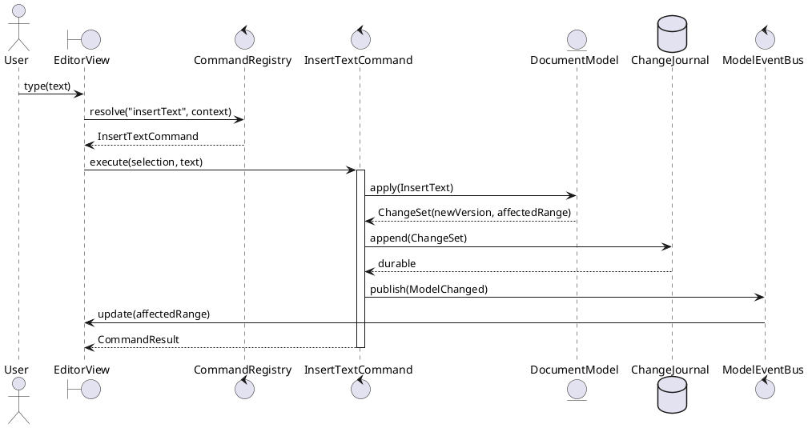
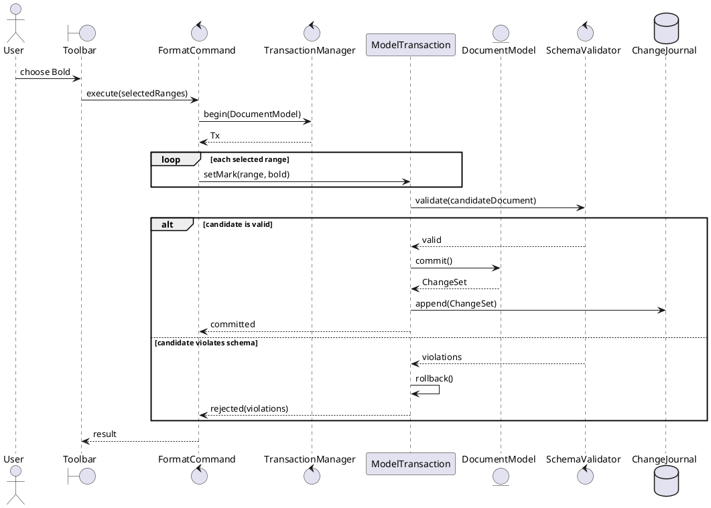
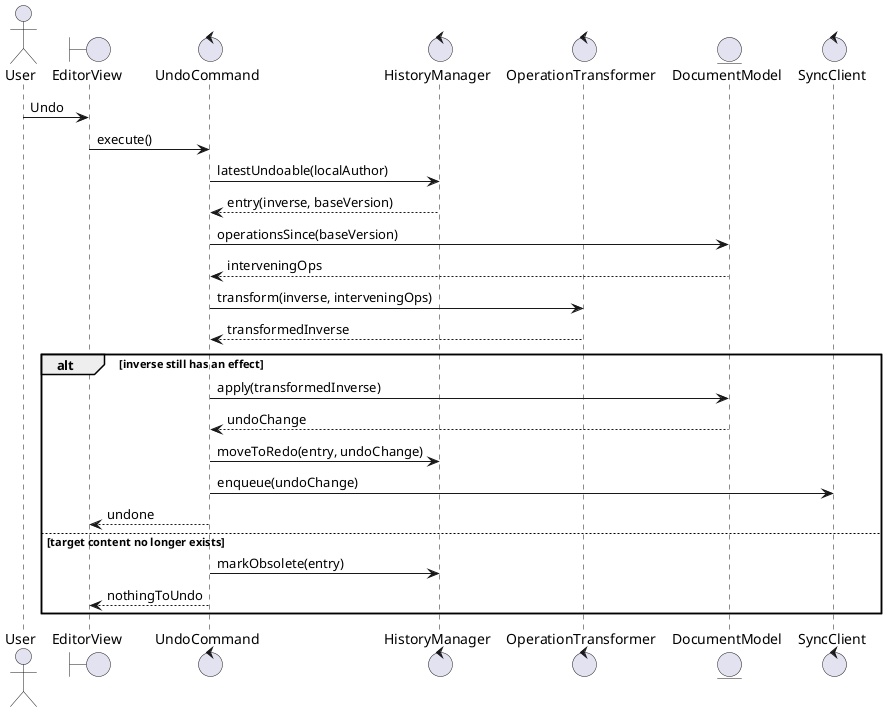
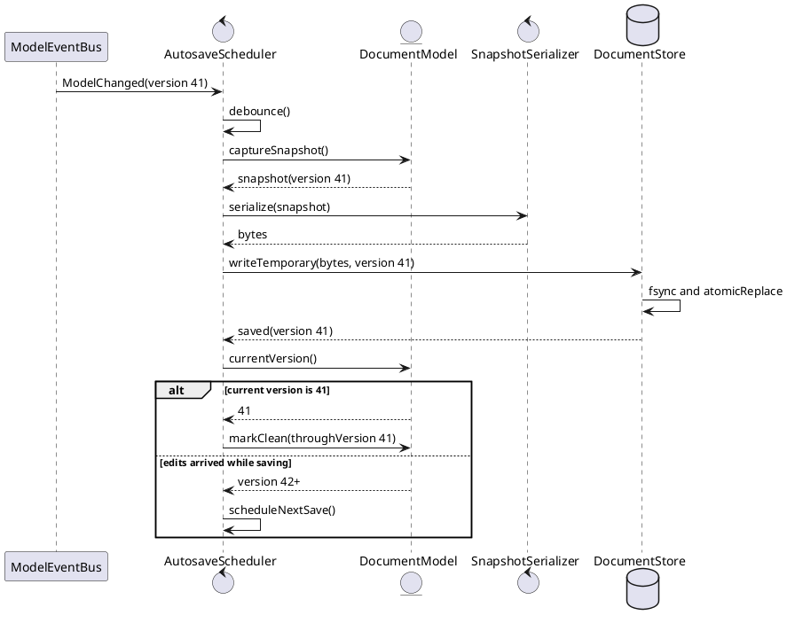
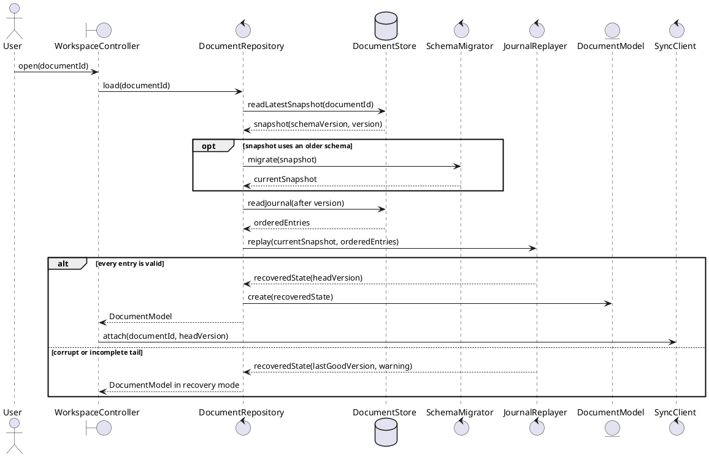
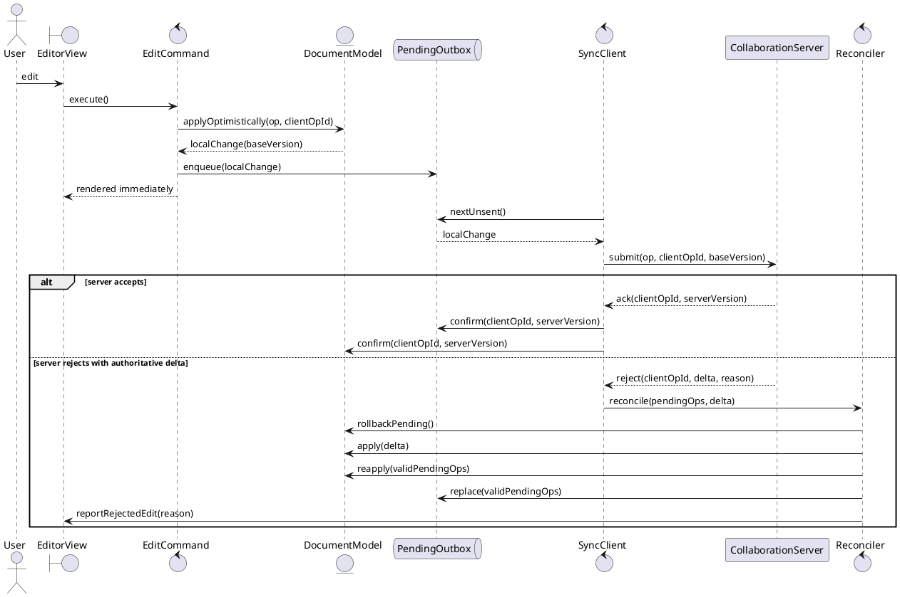
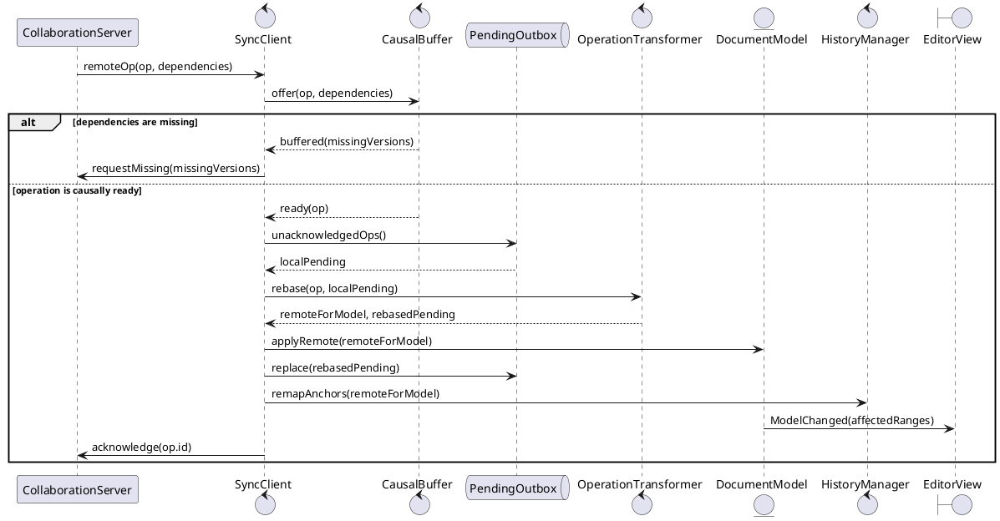
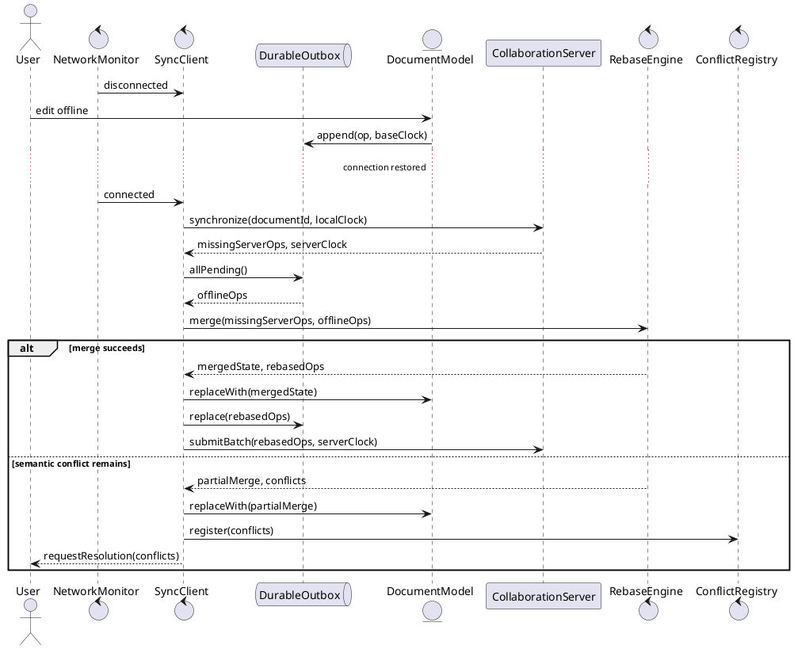
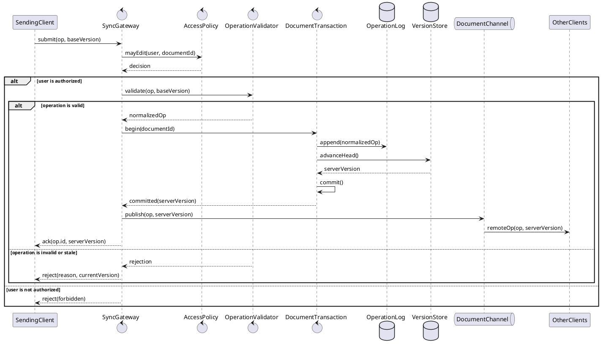
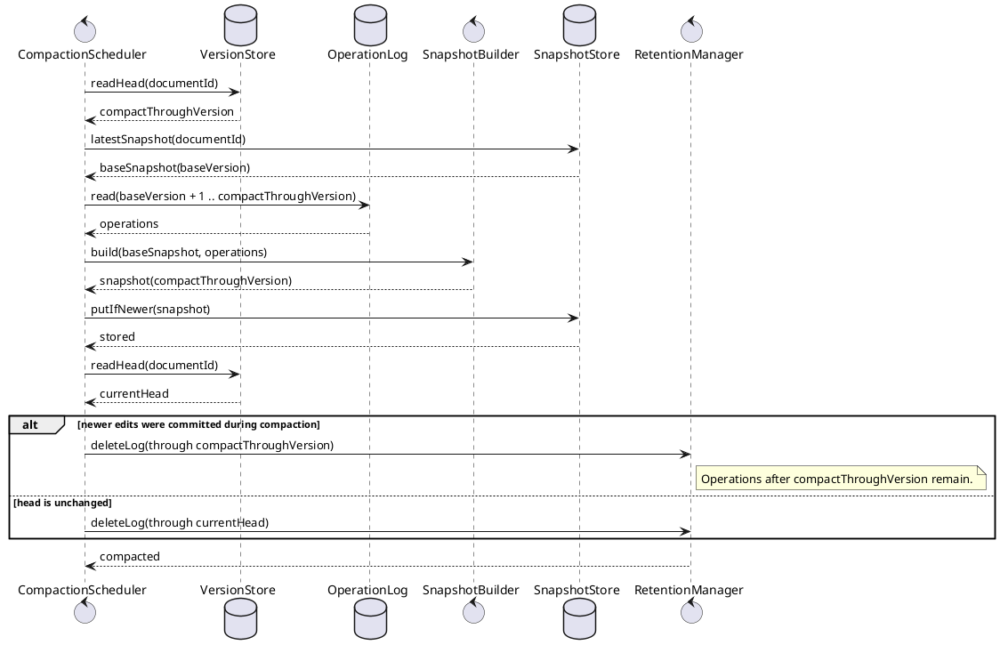

# Collaborative editor class and object interactions

## 1. Command dispatch and local change publication

Intent: Trace a keystroke from command lookup through a durable model mutation and incremental view update.

## 2. Atomic multi-range formatting command

Intent: Show how one command validates and applies several mutations as a single transaction or rolls them all back.

## 3. Selective undo in the presence of remote edits

Intent: Undo the current user's latest command by transforming its inverse over intervening remote operations instead of rewinding the whole document.

## 4. Version-aware autosave

Intent: Persist a stable snapshot without clearing the dirty flag when newer edits arrive during the save.

## 5. Document opening and crash recovery

Intent: Reconstruct a valid current model from a stored snapshot plus journal entries, migrating old data before exposure to the editor.

## 6. Optimistic local synchronization

Intent: Apply a local operation immediately, then either confirm it at the server version or reconcile an authoritative rejection.

## 7. Causally ordered remote operation delivery

Intent: Buffer an out-of-order remote operation, then transform and apply it once its causal dependencies are available.

## 8. Offline editing and reconnection

Intent: Merge server changes first on reconnect, rebase durable offline operations, and surface only conflicts that cannot be represented automatically.

## 9. Durable server commit before broadcast

Intent: Ensure collaborators observe an operation only after authorization, validation, and an atomic durable commit establish its server version.

## 10. Concurrent-safe snapshot compaction

Intent: Compact an operation log at a captured version without deleting newer operations committed while the snapshot is being built.

