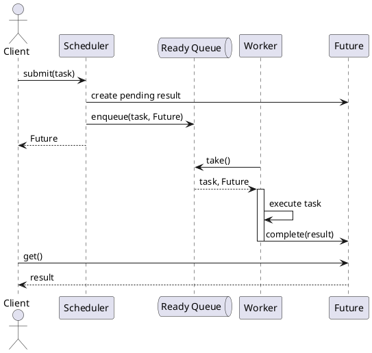
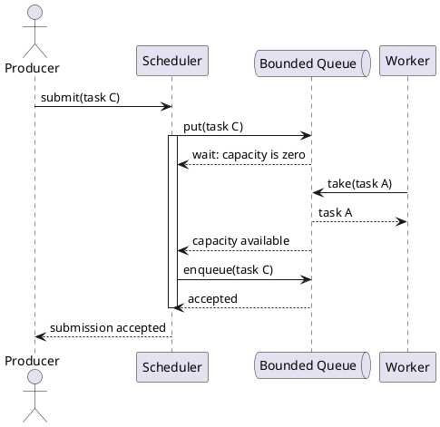
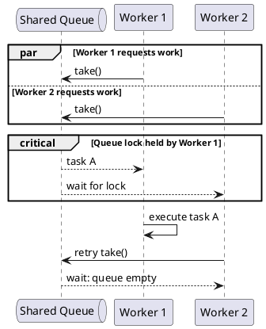
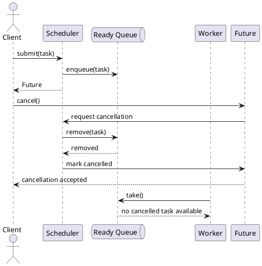
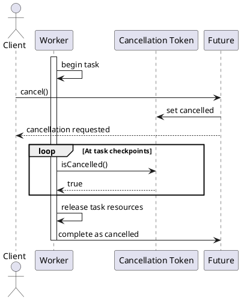
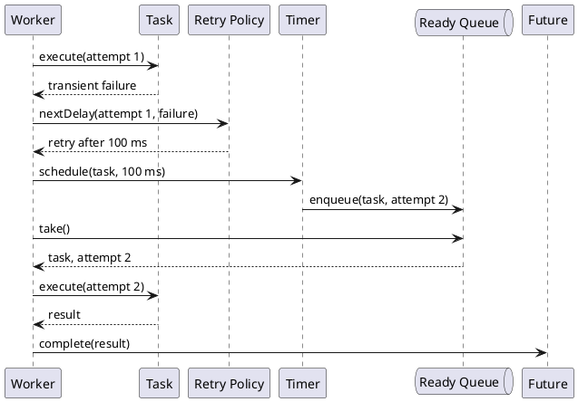
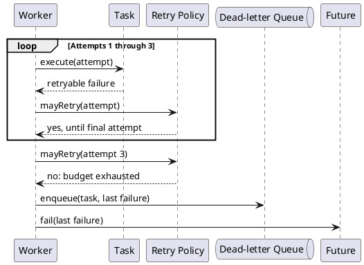
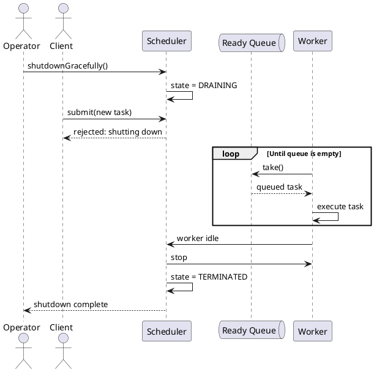
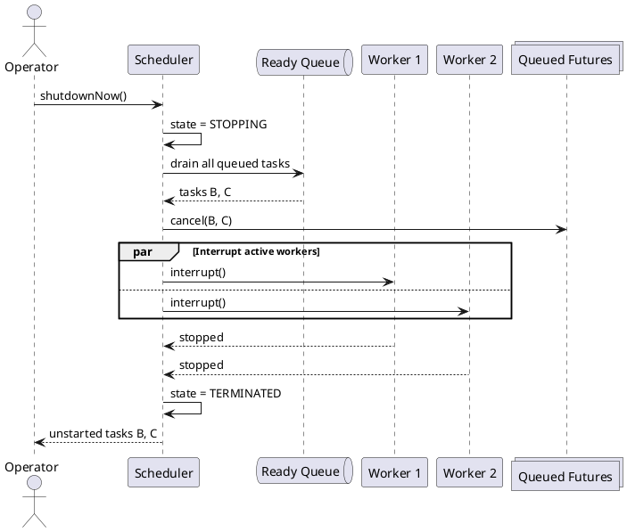
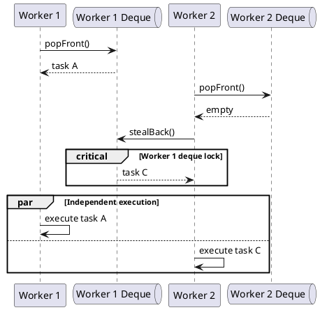

# Multithreaded Task Scheduler

## 1. Normal task lifecycle

Intent: Show the happy path from submission through queueing, worker execution, and result delivery.

## 2. Bounded queue backpressure

Intent: Show how a full queue blocks a producer until a worker creates capacity.

## 3. Contention on a shared queue

Intent: Show two workers racing for the same task while the queue lock serializes access.

## 4. Cancelling a queued task

Intent: Show cancellation winning before dispatch so the task never starts.

## 5. Cooperative cancellation during execution

Intent: Show a running task observing a cancellation token and terminating cleanly.

## 6. Transient failure and successful retry

Intent: Show retry scheduling with backoff followed by success on a later attempt.

## 7. Retry budget exhausted

Intent: Show repeated failure crossing the retry limit and becoming a terminal result.

## 8. Graceful shutdown with draining

Intent: Show shutdown rejecting new work while allowing queued and running tasks to finish.

## 9. Immediate shutdown

Intent: Show an urgent stop cancelling queued work and interrupting running workers.

## 10. Work stealing under uneven load

Intent: Show an idle worker stealing from a busy worker's local queue to balance load without a central hot spot.

