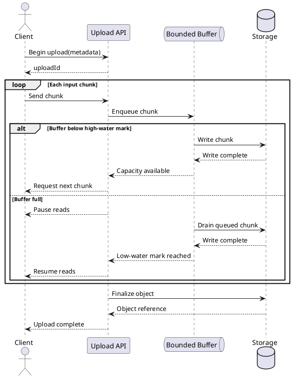
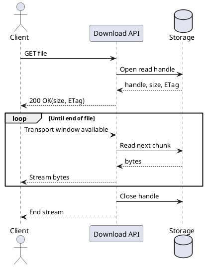
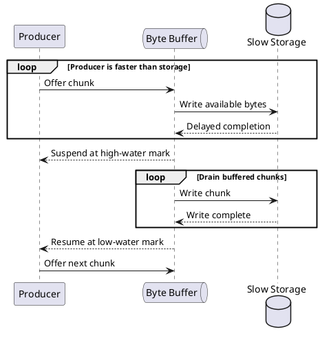
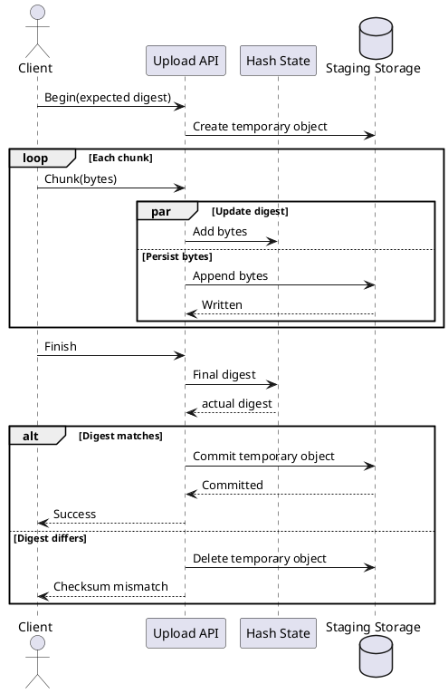
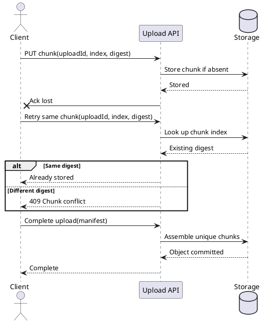
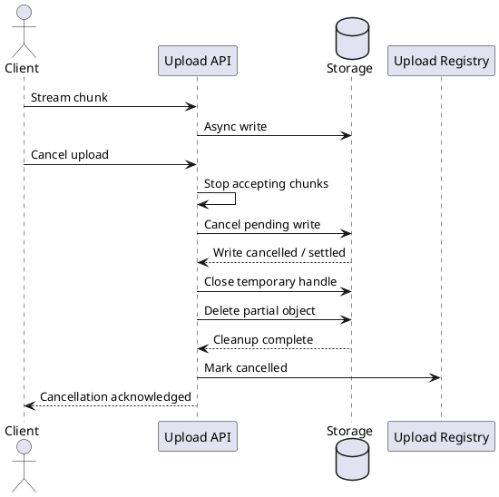
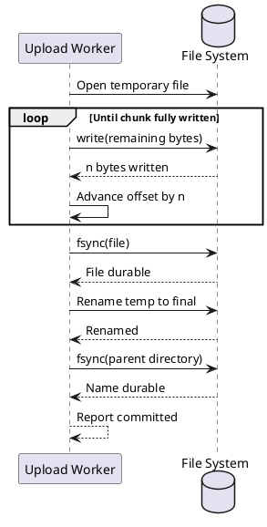
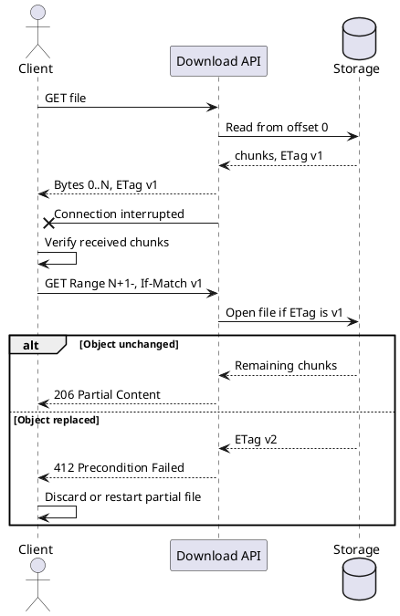
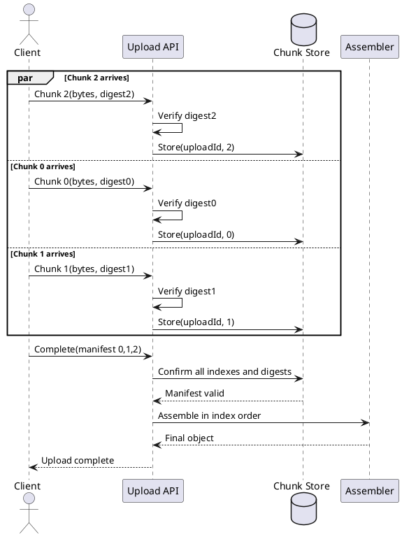
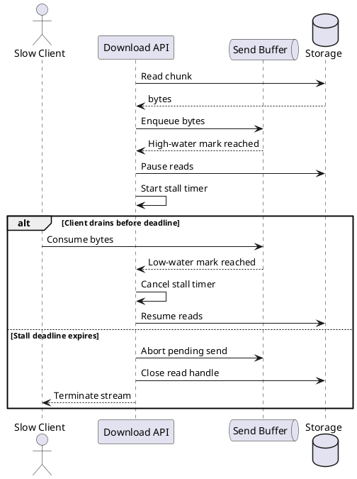

# Streaming File I/O

## 1. Backpressured upload pipeline

Shows how a bounded upload pipeline advances only when downstream capacity becomes available.

## 2. Demand-driven download

Illustrates a download that reads from storage only in response to transport demand.

## 3. High- and low-water buffering

Makes buffer watermarks and producer suspension explicit during a temporary storage slowdown.

## 4. Incremental checksum and atomic commit

Shows checksum calculation during streaming and publication only after end-to-end validation.

## 5. Idempotent chunk retry

Demonstrates safe recovery from an ambiguous response by identifying each chunk and deduplicating retries.

## 6. Cancellation propagation and cleanup

Traces client cancellation through active I/O and removal of incomplete upload state.

## 7. Partial writes and durable finalization

Captures the storage loop required for short writes and the durability boundary before success is reported.

## 8. Resumable download after interruption

Shows how a client resumes from the last verified offset while guarding against object replacement.

## 9. Concurrent chunks and ordered assembly

Explains how parallel chunk arrival is validated independently before deterministic assembly.

## 10. Slow-consumer timeout

Shows backpressure stopping storage reads and a timeout closing resources when a downloader remains stalled.

