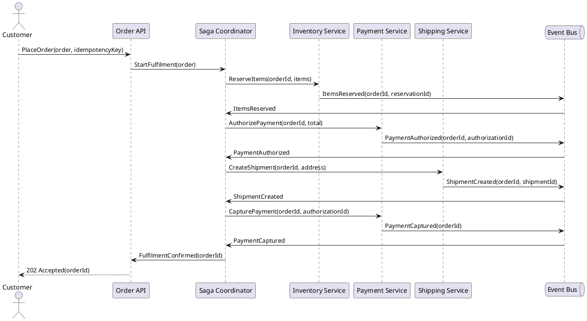
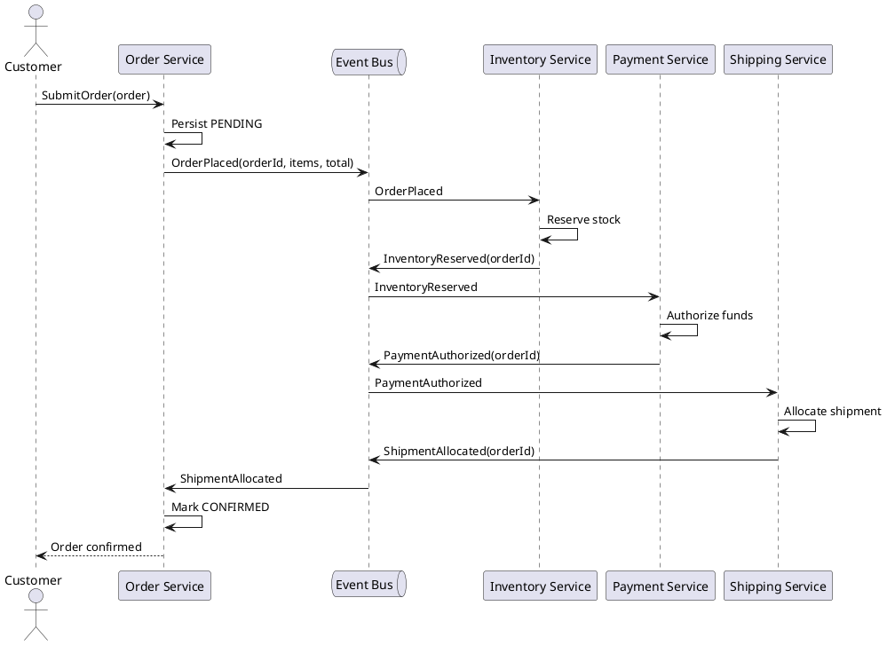
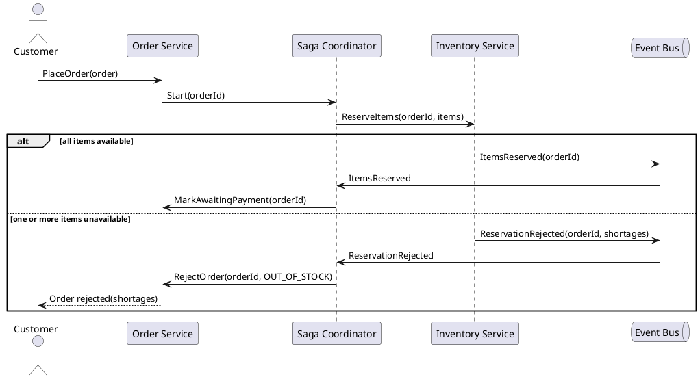
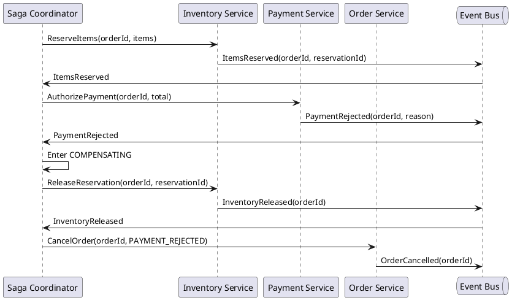
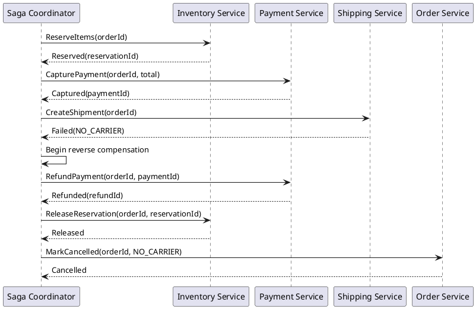
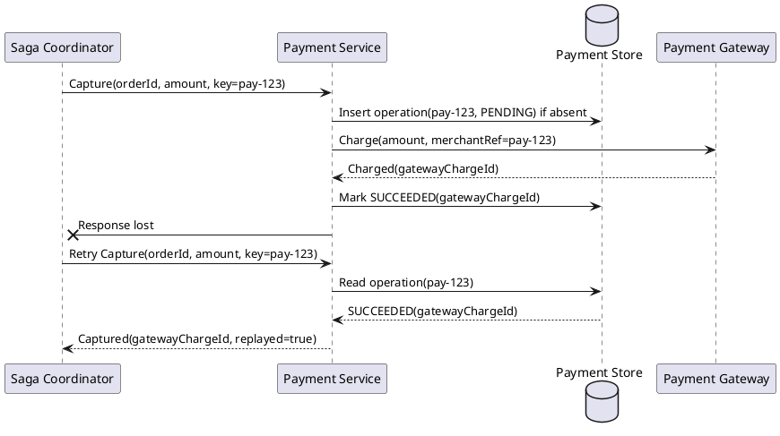
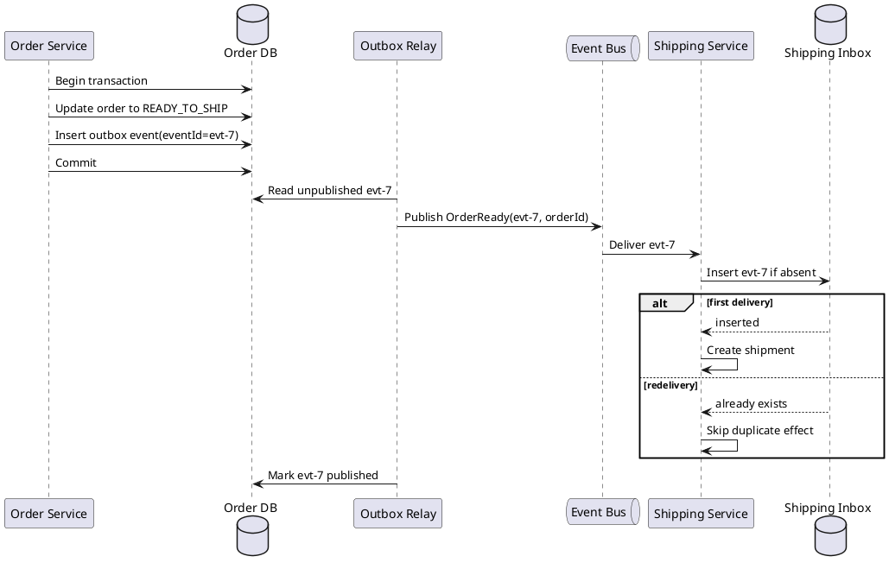
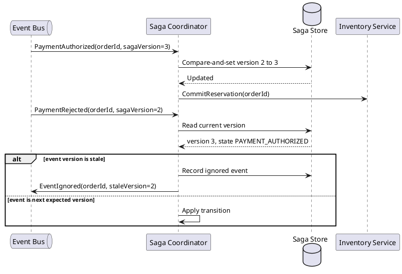
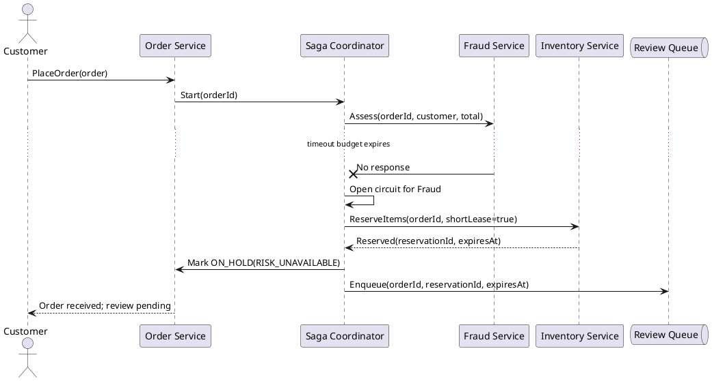

# Service-oriented e-commerce order fulfilment

## 1. Orchestrated fulfilment happy path

Intent: Trace the saga coordinator through inventory, payment, and shipping while each service commits locally and reports progress by event.



## 2. Choreographed fulfilment through domain events

Intent: Show services advancing a fulfilment without a central coordinator by reacting only to durable domain events.



## 3. Inventory rejection before payment

Intent: Make an early saga rejection explicit when stock cannot be reserved and no downstream compensation is yet required.



## 4. Payment rejection compensates inventory

Intent: Trace the reverse action that releases a completed stock reservation after payment authorization fails.



## 5. Shipment failure triggers multi-step compensation

Intent: Show compensation proceeding in reverse order when fulfilment fails after both stock reservation and payment capture.



## 6. Ambiguous payment timeout with idempotent retry

Intent: Demonstrate how a stable operation key prevents a retry from charging twice when the first response is lost.



## 7. Transactional outbox and consumer deduplication

Intent: Preserve an atomic local state change and event publication while ensuring redelivery cannot repeat the shipping side effect.



## 8. Out-of-order events guarded by saga version

Intent: Prevent a delayed failure event from reversing a saga that has already advanced on a newer causally valid event.



## 9. Degraded fraud dependency routes order to review

Intent: Keep the order safe and visible when a non-responsive risk service prevents an automated fulfilment decision.



## 10. Coordinator crash and durable saga recovery

Intent: Resume an in-flight saga from its persisted step and safely repeat a command after the coordinator restarts.

```plantuml
@startuml
participant "Saga Coordinator" as Saga
database "Saga Store" as Store
participant "Inventory Service" as Inventory
participant "Payment Service" as Payment

Saga -> Inventory: ReserveItems(orderId, commandId=reserve-9)
Inventory --> Saga: Reserved(reservationId)
Saga -> Store: Save INVENTORY_RESERVED, next=AUTHORIZE_PAYMENT
Store --> Saga: Durable
... coordinator process crashes ...
destroy Saga
participant "Restarted Coordinator" as Restarted
Restarted -> Store: Load incomplete sagas
Store --> Restarted: orderId, next=AUTHORIZE_PAYMENT
Restarted -> Payment: Authorize(orderId, commandId=auth-9)
Payment --> Restarted: Authorized(authorizationId)
... coordinator crashes before checkpoint ...
destroy Restarted
participant "Coordinator after retry" as Retry
Retry -> Store: Load incomplete saga
Store --> Retry: next=AUTHORIZE_PAYMENT
Retry -> Payment: Retry Authorize(commandId=auth-9)
Payment --> Retry: Same authorizationId
Retry -> Store: Save PAYMENT_AUTHORIZED
@enduml
```
