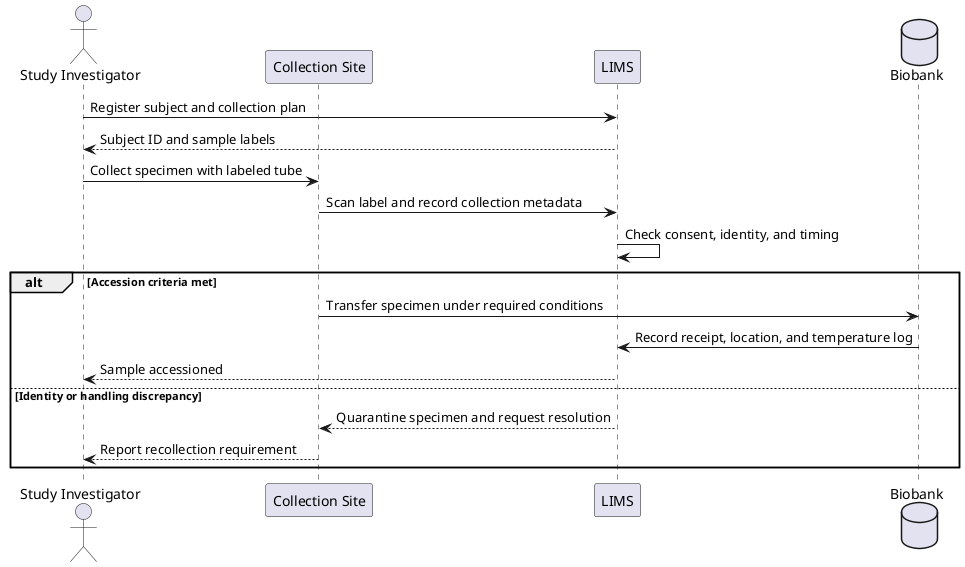
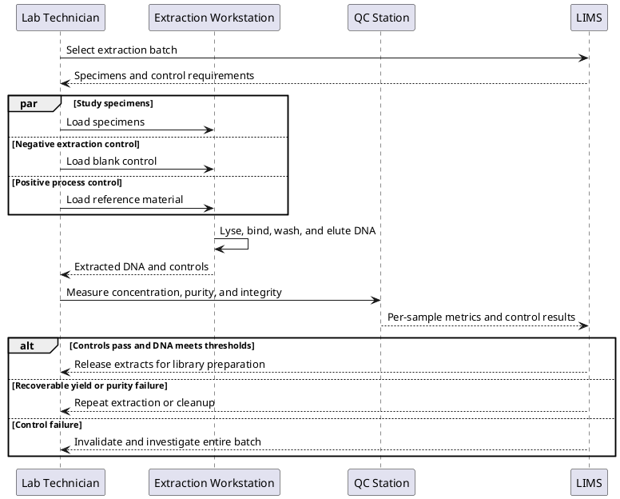
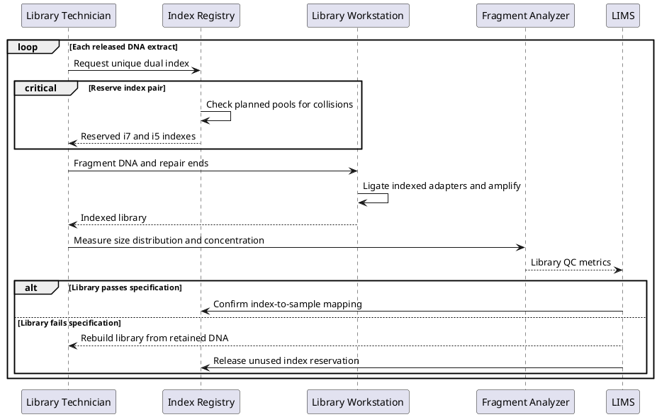
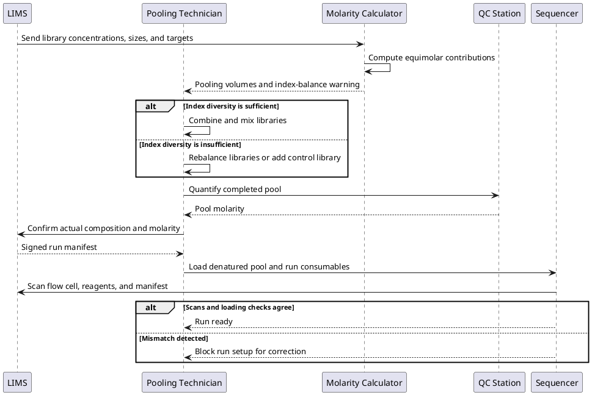
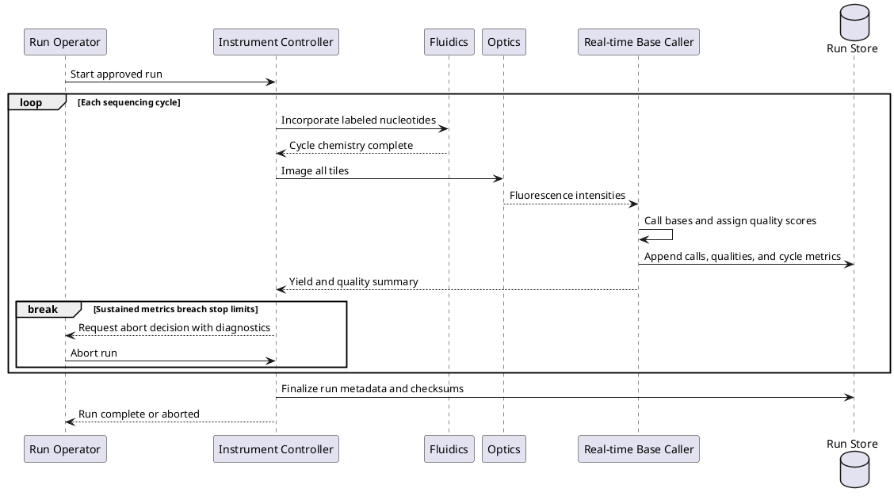
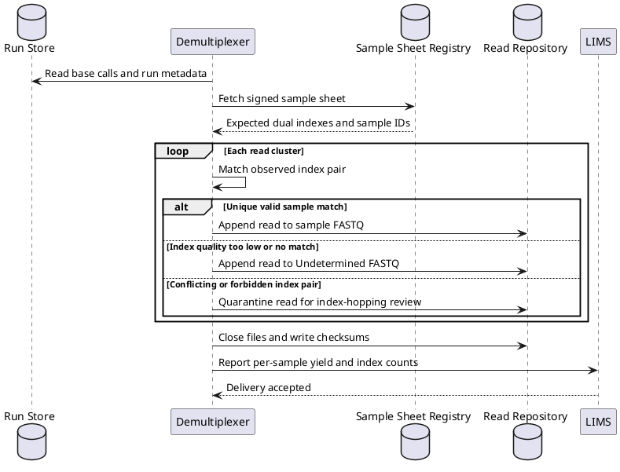
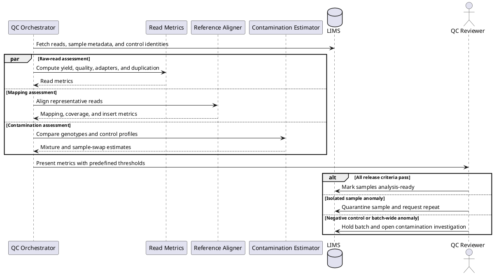
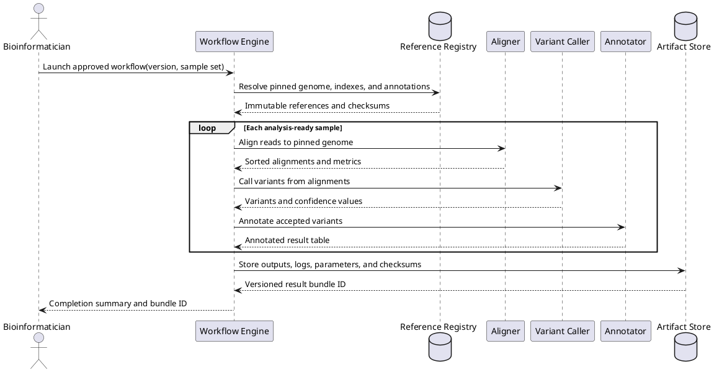
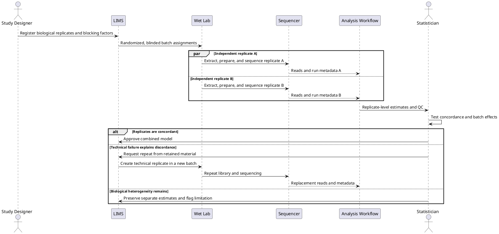
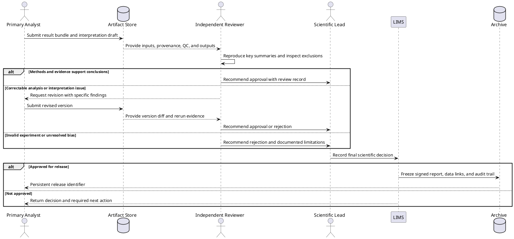

# Scientific DNA Sequencing Experiment

## 1. Sample accession and chain of custody

Shows how a collected specimen becomes a traceable study sample or is rejected before laboratory work begins.

## 2. DNA extraction with process controls

Tracks study specimens and controls through extraction, quantification, and the decision to proceed or repeat.

## 3. Library construction and index assignment

Explains how DNA is converted into sequenceable libraries while preventing index collisions and retaining per-sample provenance.

## 4. Normalization, pooling, and flow-cell loading

Shows how accepted libraries are balanced into a pool, checked against the run manifest, and loaded at the intended concentration.

## 5. Sequencing cycle and live run monitoring

Details the repeated chemistry, imaging, base-calling, and live-quality decision inside an instrument run.

## 6. Demultiplexing and read-file delivery

Illustrates how instrument output is assigned to samples, quarantined when indexes are ambiguous, and delivered as verified read files.

## 7. Quality-control and contamination triage

Combines independent read, alignment, and control checks into a clear pass, review, or batch-failure decision.

## 8. Reproducible sequence analysis

Shows a workflow engine pinning inputs and references, executing sample-level analysis, and preserving an auditable result bundle.

## 9. Replication and discordance resolution

Captures independent biological replicates, selective technical repeats, and the investigation required before combining evidence.

## 10. Scientific result review and release

Shows independent review of analytical evidence, revision loops, and controlled release of a traceable result package.

