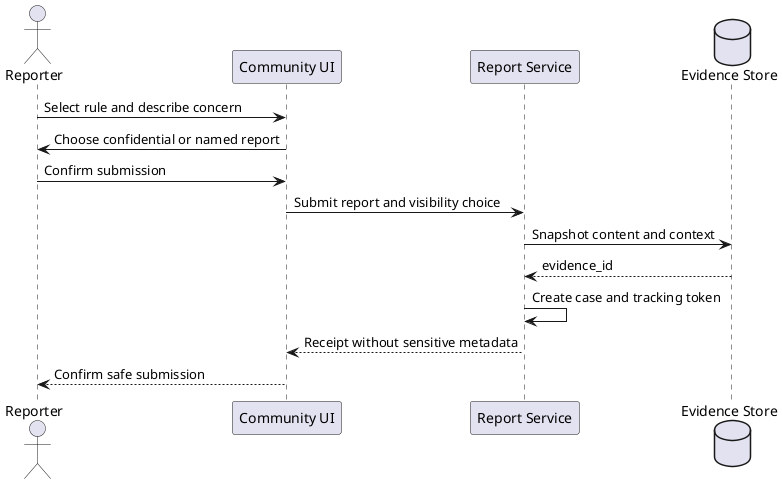
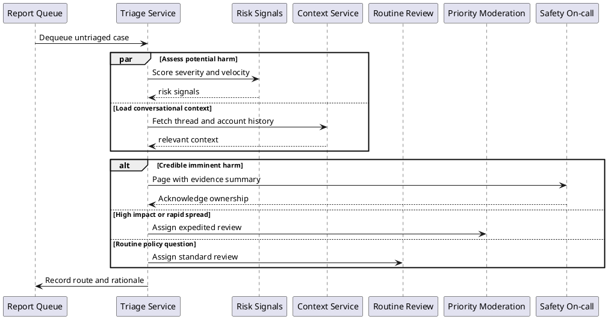
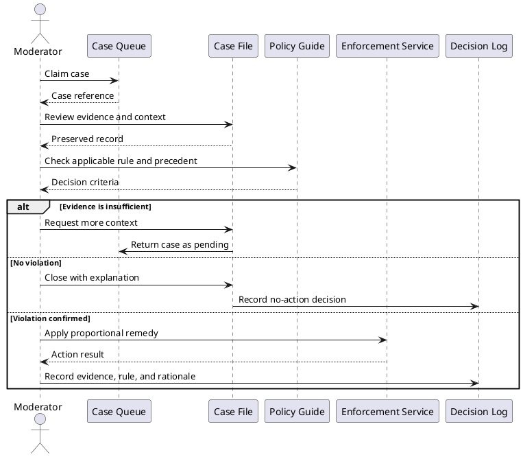
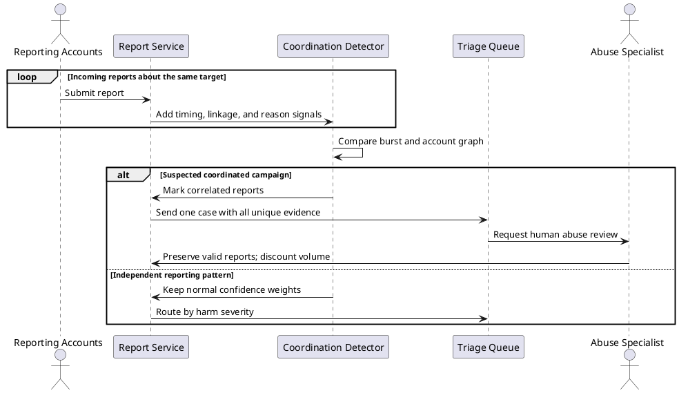
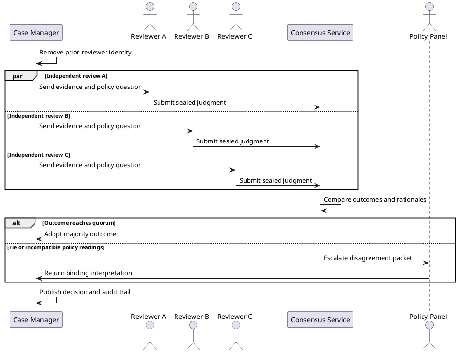
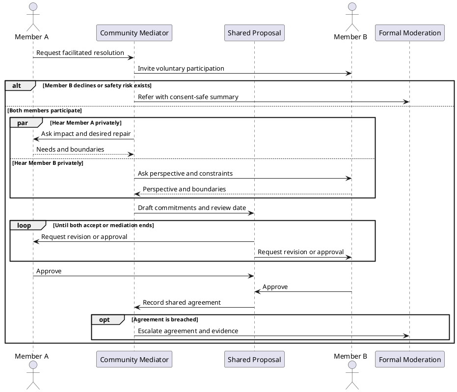
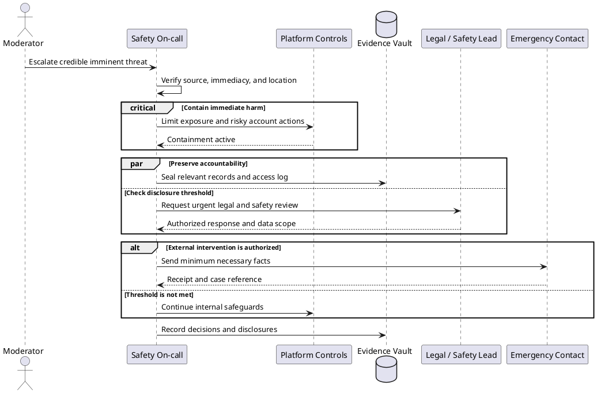
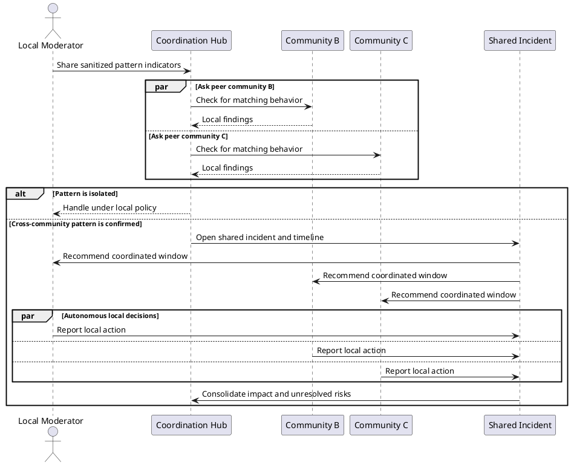
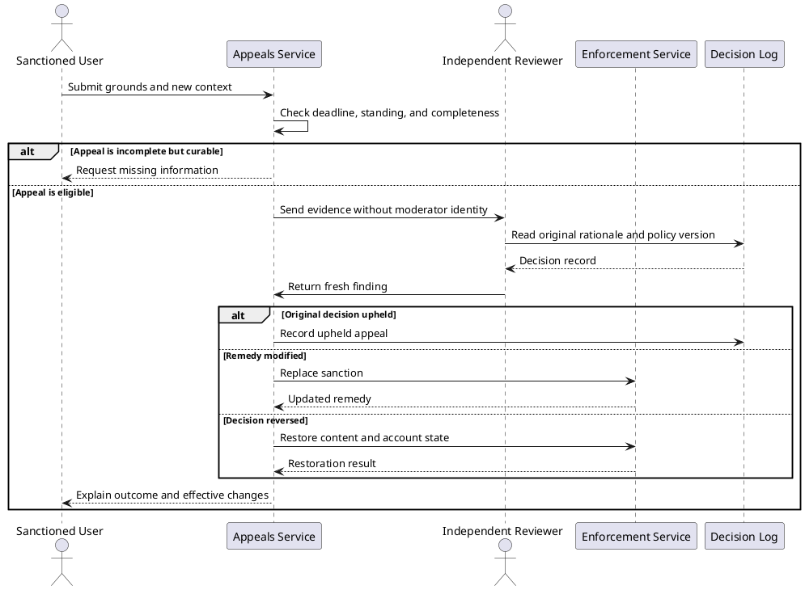
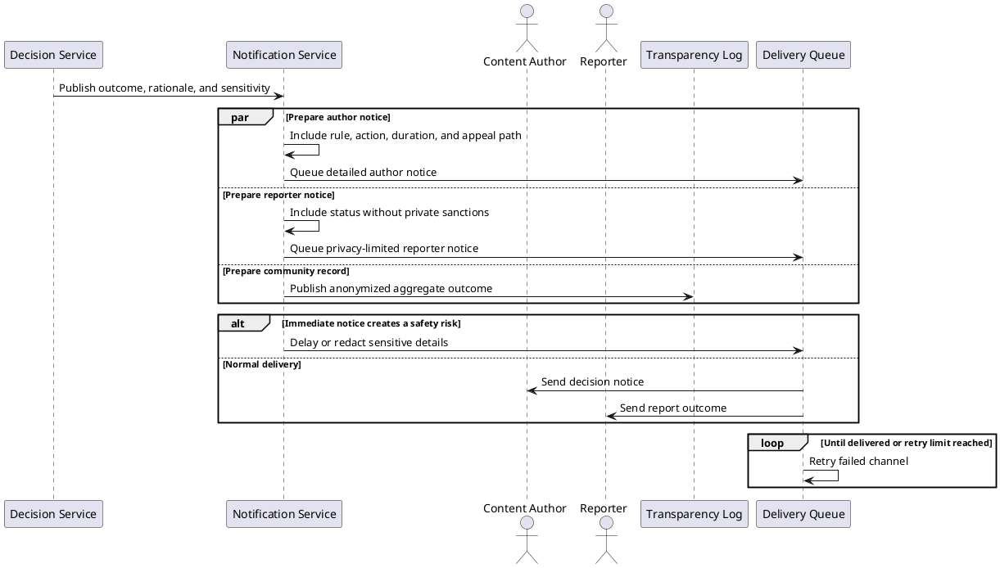

# Community Moderation and Social Coordination

## 1. Safe report intake

Intent: Capture a report, preserve the relevant evidence, and protect the reporter's chosen level of visibility.

## 2. Risk-based triage

Intent: Combine severity, context, and reach signals to route each case to an appropriate response queue.

## 3. Moderator adjudication

Intent: Help a moderator test evidence against policy and apply a proportional, auditable outcome.

## 4. Coordinated-reporting abuse defense

Intent: Detect report brigading without discarding legitimate safety signals or allowing report volume to decide guilt.

## 5. Consensus for an ambiguous case

Intent: Use independent judgments and a clear quorum rule when one moderator's decision would be too fragile.

## 6. Community-mediated conflict resolution

Intent: Let participants negotiate a shared remedy for interpersonal conflict while retaining a path to formal moderation.

## 7. Emergency safety escalation

Intent: Contain credible imminent harm quickly while minimizing unnecessary disclosure and preserving later accountability.

## 8. Cross-community incident coordination

Intent: Coordinate a threat spanning several communities while leaving each community responsible for its own rules and actions.

## 9. Independent appeal review

Intent: Reconsider a moderation outcome using a reviewer separated from the original decision and restore effects when warranted.

## 10. Role-specific outcome notification

Intent: Inform affected people consistently while tailoring detail for privacy, safety, and each recipient's legitimate needs.

