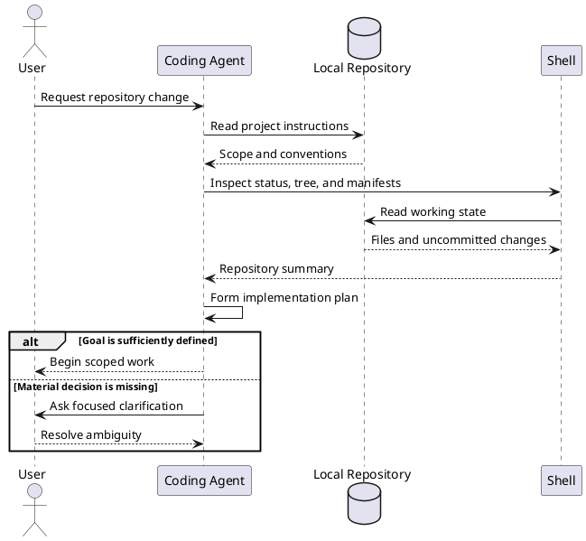
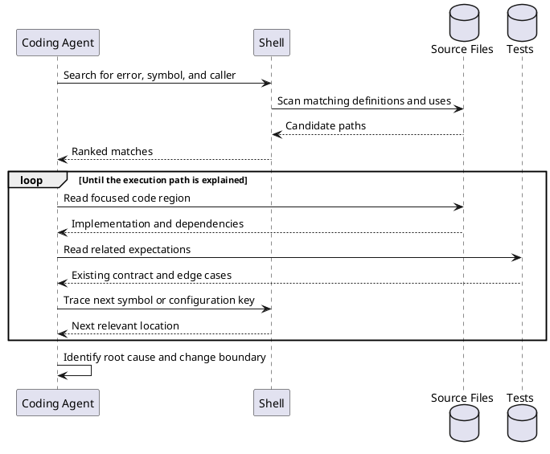
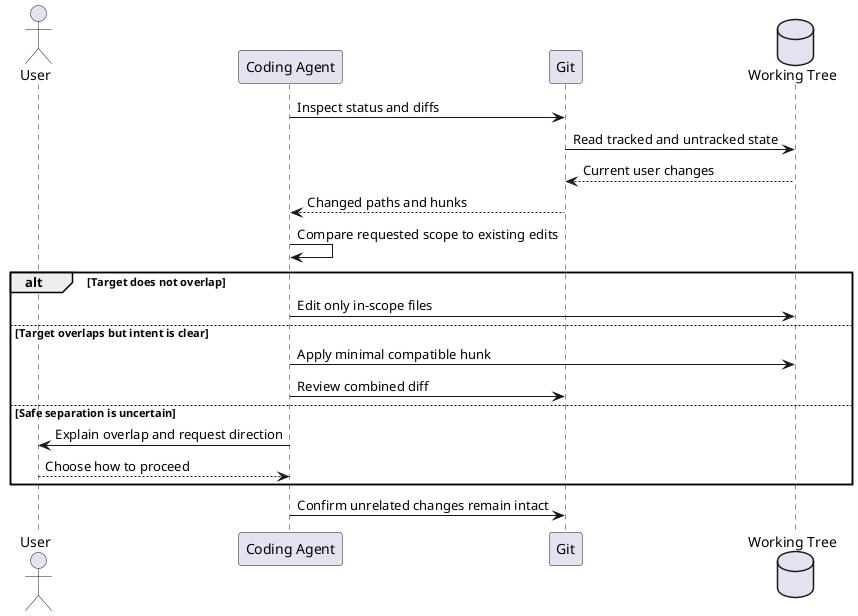
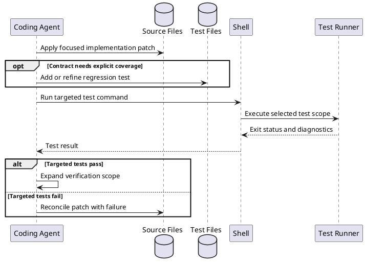
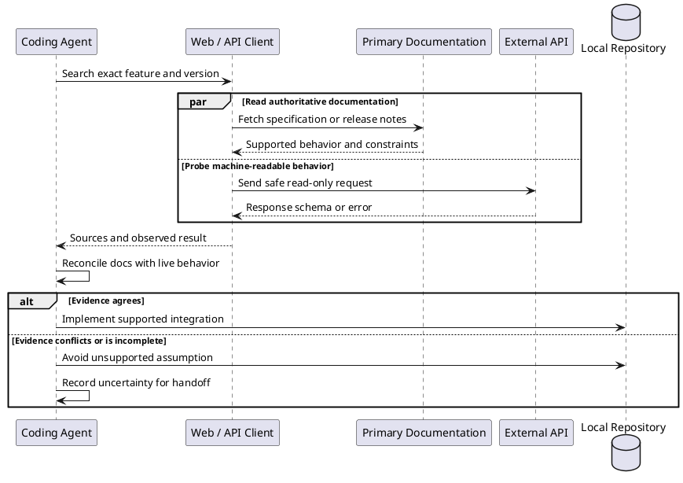
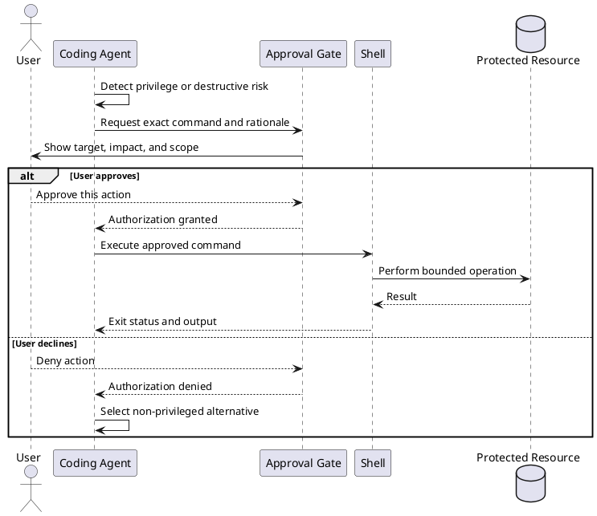
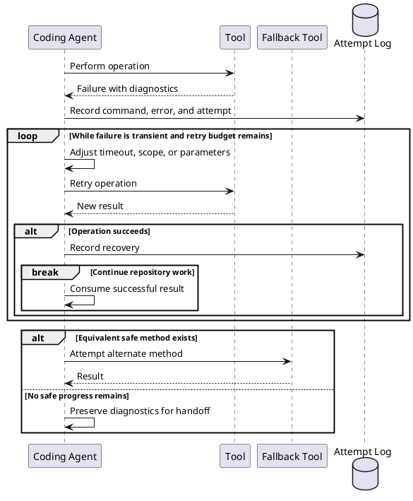
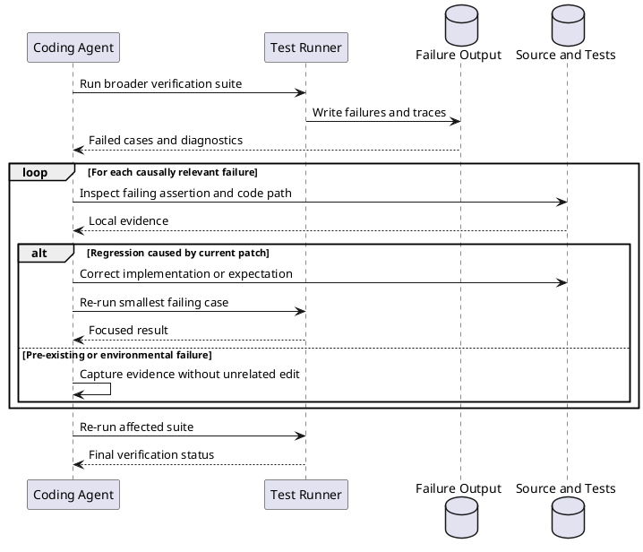
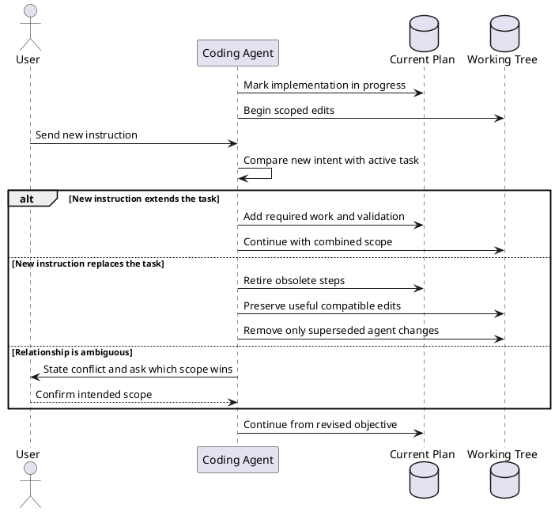
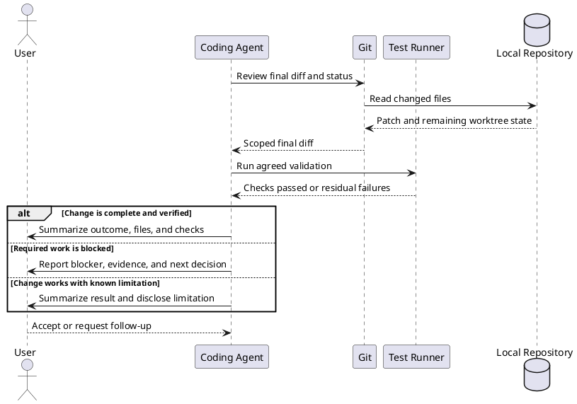

# AI Coding Agent Repository Task

## 1. Task intake and repository orientation

Intent: Establish the requested outcome, repository rules, and current working state before choosing an implementation path.

## 2. Tracing a behavior through local code

Intent: Follow symbols from entry point to tests so the agent changes the responsible code rather than a nearby symptom.

## 3. Preserving unrelated work

Intent: Isolate the requested edit when the worktree already contains user-owned changes.

## 4. Patch and targeted-test cycle

Intent: Make a small local change and use the narrowest relevant test to obtain fast feedback.

## 5. Researching an unstable external dependency

Intent: Verify time-sensitive behavior against authoritative web or API sources before encoding an assumption in the repository.

## 6. Approval-gated privileged action

Intent: Keep a consequential command behind an explicit user decision while retaining a safe path forward.

## 7. Recovering from a transient tool failure

Intent: Retry only recoverable failures, vary the approach when useful, and stop once further attempts would be unsafe or redundant.

## 8. Diagnosing and repairing a failing test suite

Intent: Turn broad suite failures into a minimal causal fix, distinguishing regressions from unrelated environmental failures.

## 9. Handling a user scope change mid-task

Intent: Incorporate an additive request or replace obsolete work without silently carrying the old scope forward.

## 10. Final verification and handoff

Intent: Deliver a concise result backed by diff review, relevant checks, and explicit disclosure of anything unresolved.

