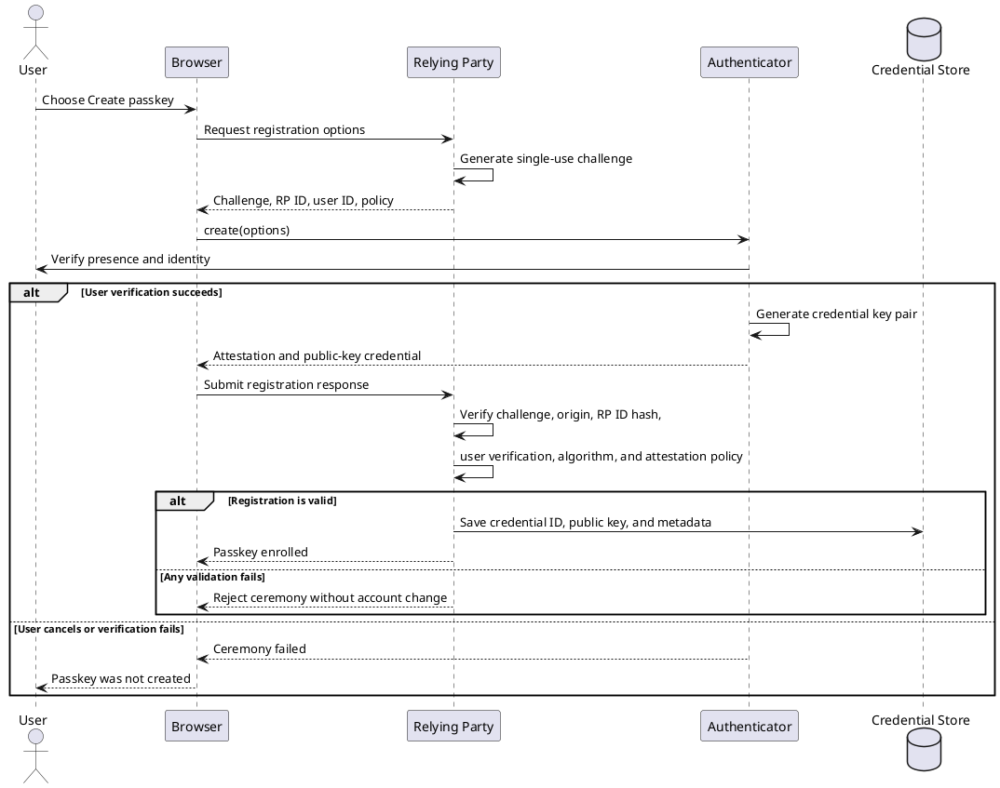
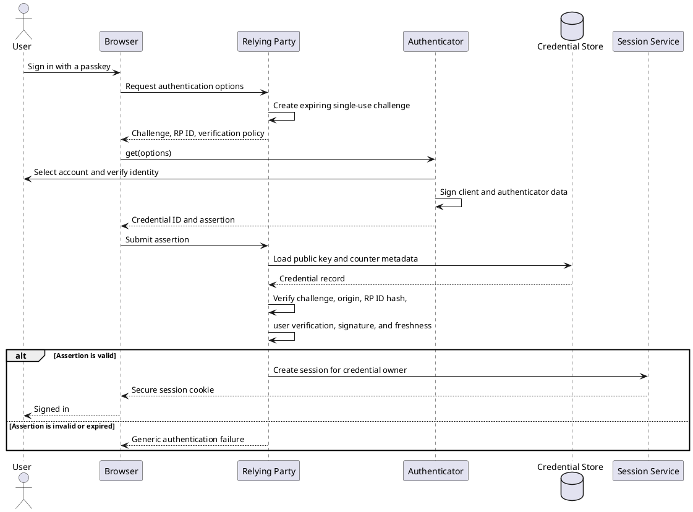
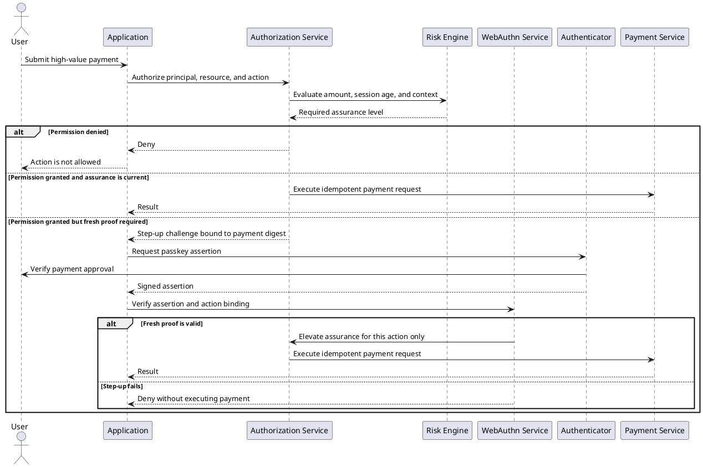
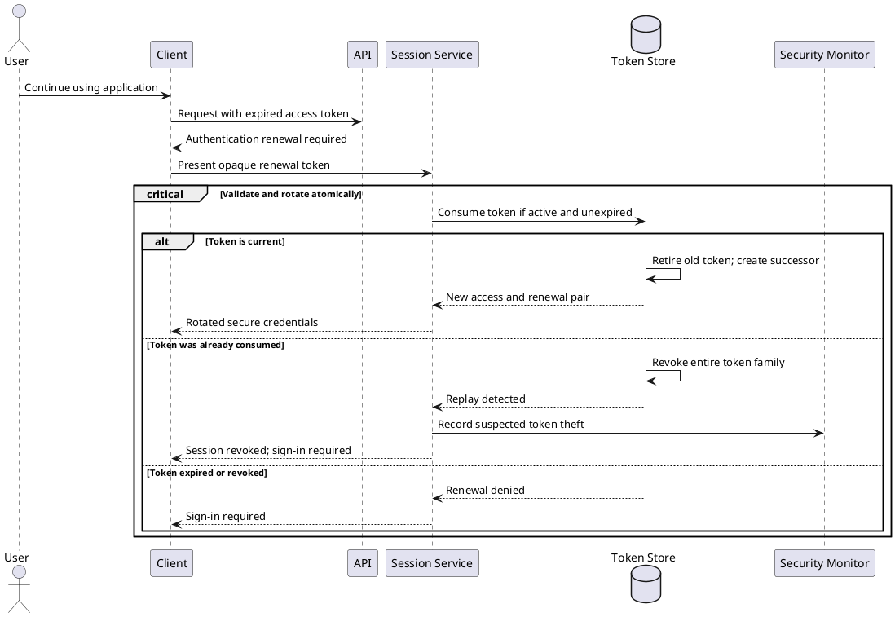
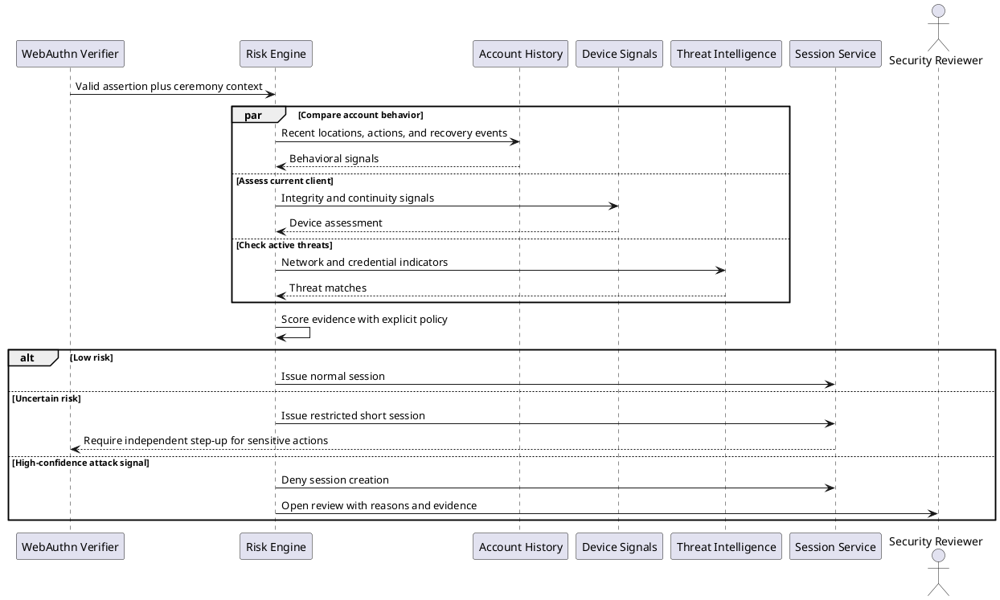
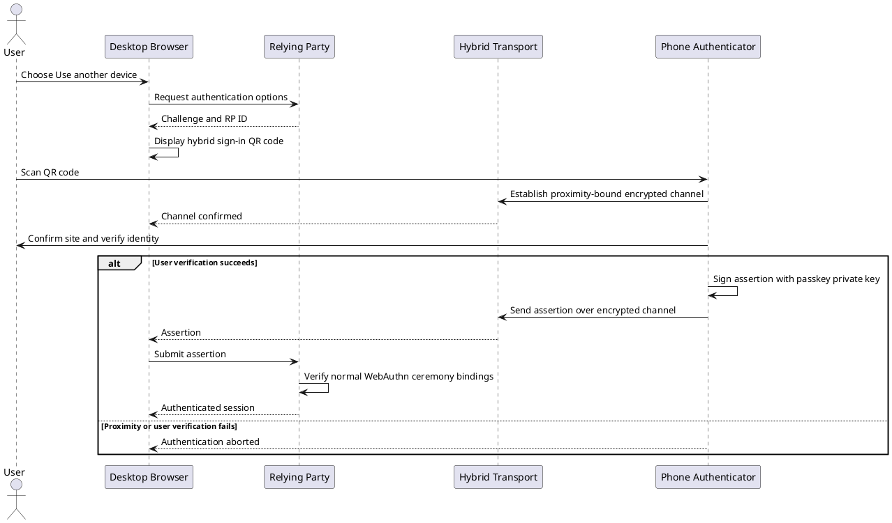
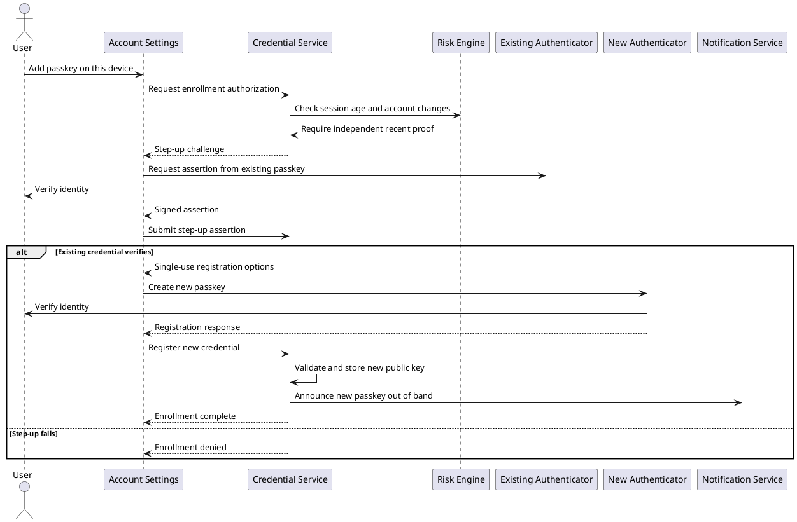
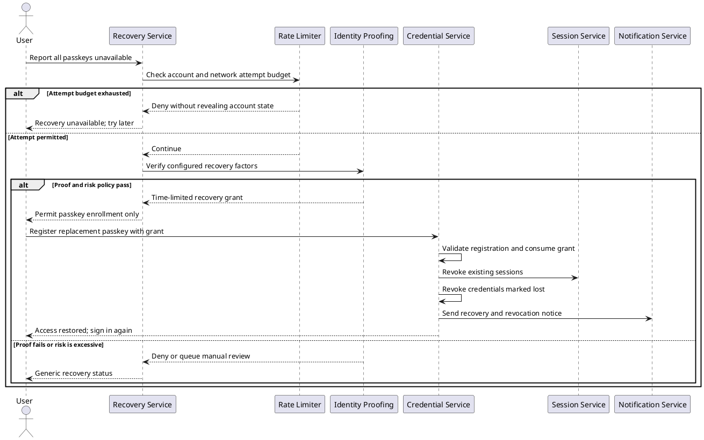
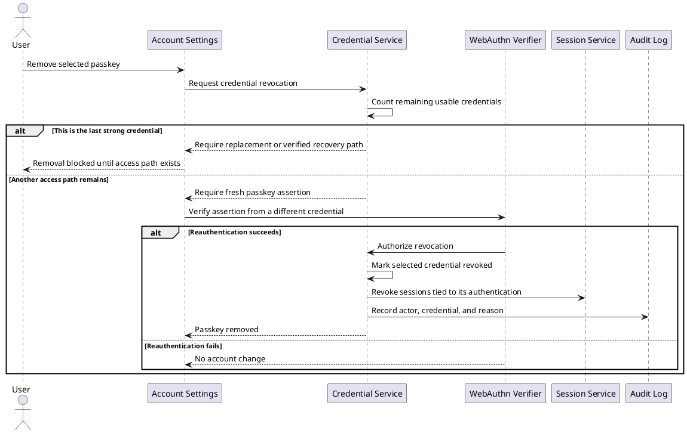
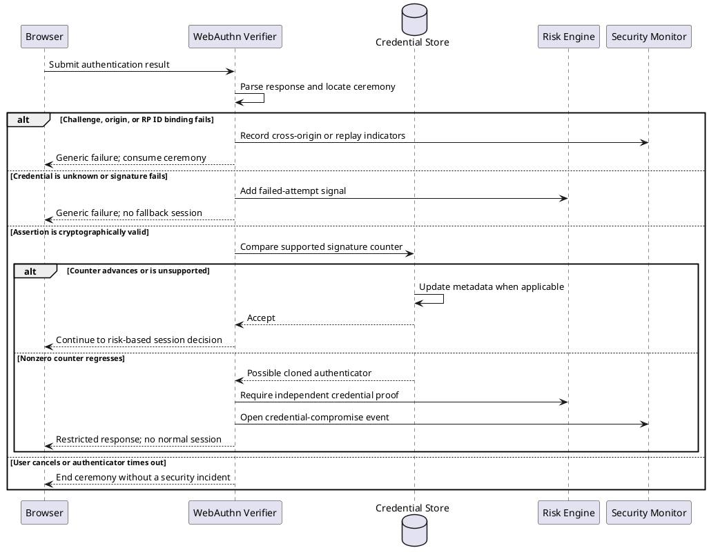

# Passkey Security and Account Control

## 1. Passkey enrollment

Intent: Bind a newly created public key to the correct account only after the relying party validates the complete WebAuthn registration ceremony.

## 2. Passwordless sign-in

Intent: Authenticate a user with a discoverable credential while rejecting assertions that are validly shaped but bound to the wrong ceremony or site.

## 3. Authorization with step-up authentication

Intent: Keep passkey authentication separate from authorization and require a fresh, action-bound proof before a sensitive operation.

## 4. Session renewal and token rotation

Intent: Renew an authenticated session atomically so that reuse of an old renewal token exposes theft and invalidates the whole token family.

## 5. Adaptive risk decision after valid authentication

Intent: Treat a valid passkey assertion as strong identity evidence while still evaluating contextual signs of session abuse or account takeover.

## 6. Cross-device passkey authentication

Intent: Let a nearby phone authenticate a browser on another device without exporting the private key or trusting the requesting device with it.

## 7. Adding a passkey from a new device

Intent: Prevent an existing but stale or stolen session from silently adding an attacker-controlled passkey.

## 8. Account recovery without a passkey

Intent: Restore access through a narrowly scoped recovery grant, then replace compromised access paths and notify the account owner.

## 9. Passkey revocation and last-credential safety

Intent: Remove a lost or unwanted passkey without allowing an attacker to strand the account or preserve sessions authenticated by a compromised credential.

## 10. WebAuthn security-failure handling

Intent: Fail closed on protocol errors, distinguish possible credential cloning from ordinary cancellation, and avoid an unsafe password downgrade.

