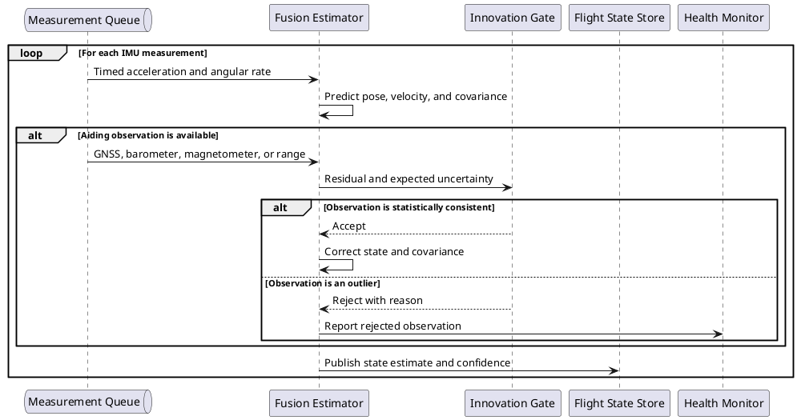
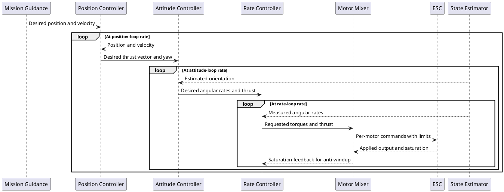
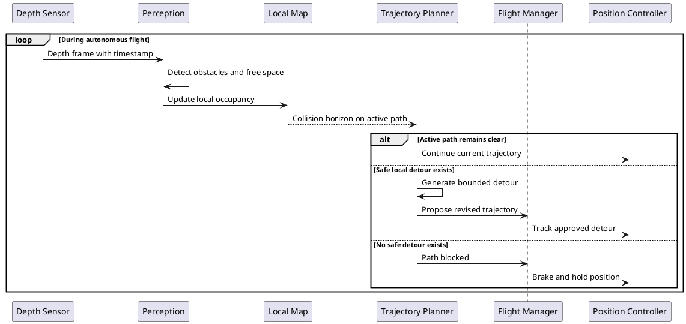
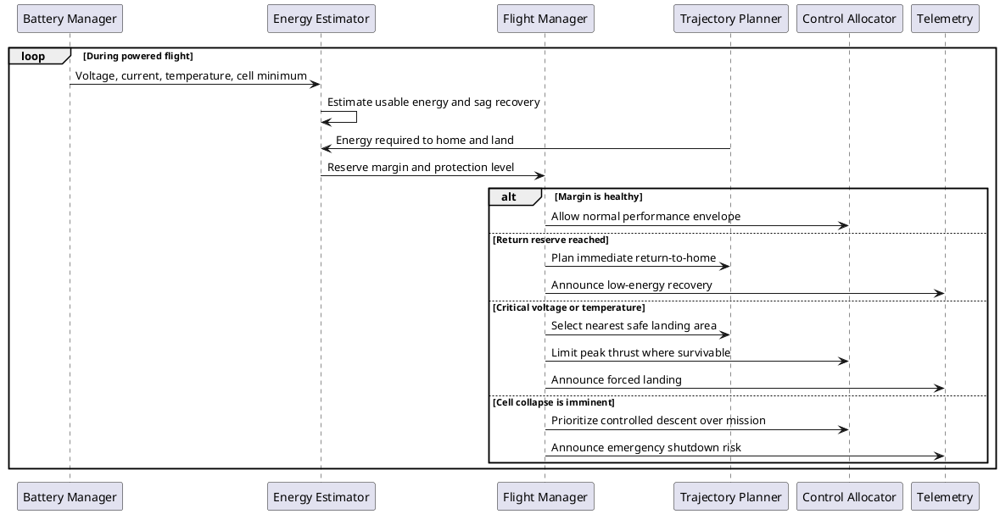
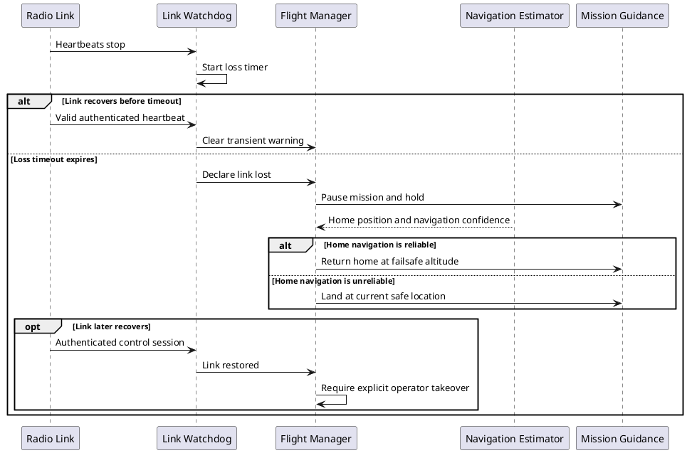
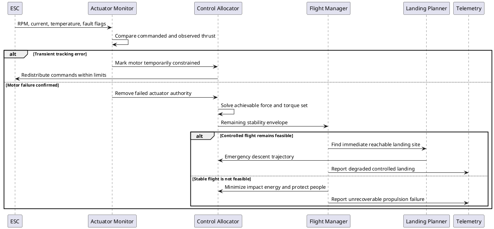

# Autonomous Drone Embedded Systems

## 1. Preflight Initialization and Arming

Intent: Show how the flight computer admits or rejects arming based on synchronized sensor, actuator, navigation, and battery checks.

```plantuml
@startuml
actor Operator
participant "Flight Manager" as FM
participant "Sensor Hub" as Sensors
participant "Navigation Estimator" as Nav
participant "Motor Controller" as Motors
participant "Battery Manager" as Battery

Operator -> FM: Request arm
par Verify sensing
  FM -> Sensors: Run self-test and calibration check
  Sensors --> FM: Sensor health and timestamps
and Verify navigation
  FM -> Nav: Request estimate quality
  Nav --> FM: Position confidence and attitude validity
and Verify propulsion
  FM -> Motors: Run actuator readiness check
  Motors --> FM: ESC and motor status
and Verify energy
  FM -> Battery: Request launch margin
  Battery --> FM: State of charge, voltage, temperature
end
alt Every mandatory check passes
  FM -> Motors: Enable outputs at idle
  FM --> Operator: Armed
else Any mandatory check fails
  FM -> Motors: Keep outputs inhibited
  FM --> Operator: Arming denied with causes
end
@enduml
```

## 2. Time-Aligned Sensor Acquisition

Intent: Show how asynchronous physical sensors become a coherent, timestamped measurement stream for estimation.

```plantuml
@startuml
participant "Hardware Clock" as Clock
participant IMU
participant "Barometer / Magnetometer" as SlowSensors
participant GNSS
participant "Sensor Hub" as Hub
queue "Measurement Queue" as Queue

loop At IMU sample rate
  Clock -> IMU: Sample trigger
  IMU -> Hub: Acceleration and angular rate
  Hub -> Clock: Read monotonic time
  Clock --> Hub: Capture timestamp
  Hub -> Hub: Calibrate, validate, tag sequence
  Hub -> Queue: Enqueue IMU measurement
end
par Periodic environmental samples
  SlowSensors -> Hub: Pressure and magnetic field
  Hub -> Queue: Enqueue timestamped samples
and GNSS receiver updates
  GNSS -> Hub: Fix, velocity, receiver time
  Hub -> Hub: Convert to monotonic timeline
  Hub -> Queue: Enqueue aligned GNSS update
end
@enduml
```

## 3. Multi-Rate State Estimation

Intent: Show the estimator predicting motion at IMU rate and correcting drift when lower-rate observations arrive.



## 4. Cascaded Flight-Control Loop

Intent: Show how a mission target is progressively converted into motor commands while fast feedback stabilizes the aircraft.



## 5. Obstacle-Aware Trajectory Revision

Intent: Show onboard perception interrupting normal path following only when an obstacle materially changes flight safety.



## 6. Command and Telemetry Exchange

Intent: Show reliable command handling alongside rate-limited status delivery over an imperfect radio link.

```plantuml
@startuml
actor "Ground Station" as Ground
participant "Radio Link" as Radio
participant "Command Gateway" as Gateway
participant "Flight Manager" as FM
participant "Telemetry Publisher" as Telemetry

par Incoming commands
  Ground -> Radio: Signed command with sequence number
  Radio -> Gateway: Deliver packet
  Gateway -> Gateway: Authenticate and reject replay
  alt Command is valid for current flight mode
    Gateway -> FM: Execute command
    FM --> Gateway: Result and resulting mode
    Gateway -> Radio: Acknowledgement
    Radio --> Ground: Command result
  else Invalid, stale, or unsafe command
    Gateway -> Radio: Negative acknowledgement with reason
    Radio --> Ground: Command rejected
  end
and Outgoing telemetry
  loop At link-adaptive rate
    FM -> Telemetry: Mode, target, and failsafe state
    Telemetry -> Radio: Prioritized compact status
    Radio --> Ground: Telemetry frame
    Radio --> Telemetry: Link quality and queue pressure
    Telemetry -> Telemetry: Adjust rate and drop low-priority fields
  end
end
@enduml
```

## 7. Sensor Fault Detection and Isolation

Intent: Show how redundancy and residual checks isolate a suspect sensor without immediately destabilizing the estimator.

```plantuml
@startuml
participant "Primary IMU" as IMU1
participant "Backup IMU" as IMU2
participant "Fusion Estimator" as Estimator
participant "Fault Monitor" as Monitor
participant "Flight Manager" as FM

par Redundant samples
  IMU1 -> Estimator: Motion sample A
and
  IMU2 -> Estimator: Motion sample B
end
Estimator -> Monitor: Cross-sensor residuals and innovations
alt Brief disagreement within recovery window
  Monitor -> Estimator: Reduce suspect sensor weight
  Estimator -> Estimator: Continue with inflated uncertainty
else Persistent fault isolated to one IMU
  Monitor -> Estimator: Exclude failed sensor
  Monitor -> FM: Redundancy degraded
  FM -> FM: Restrict aggressive maneuvers
else Fault cannot be isolated
  Monitor -> FM: Navigation integrity lost
  FM -> FM: Enter attitude-only emergency mode
end
@enduml
```

## 8. Battery Protection and Energy-Aware Recovery

Intent: Show escalating battery responses that account for voltage sag, remaining energy, and the cost of returning home.



## 9. Lost-Link Failsafe State Machine

Intent: Show the timed progression from radio degradation to autonomous recovery, with guarded reconnection handling.



## 10. Propulsion Fault and Controlled Landing

Intent: Show how actuator feedback drives rapid fault confirmation, control reallocation, and a survivability-based landing decision.


