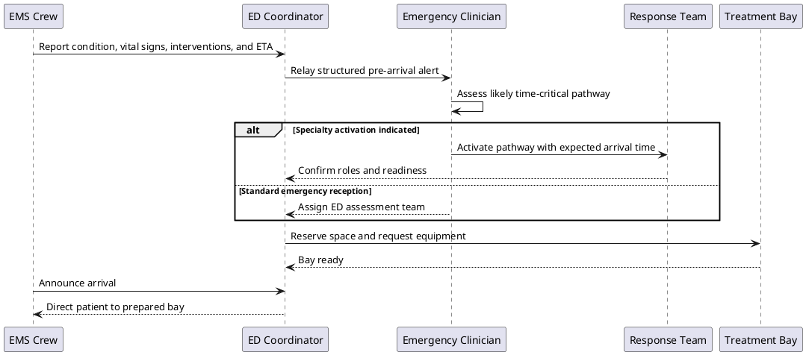
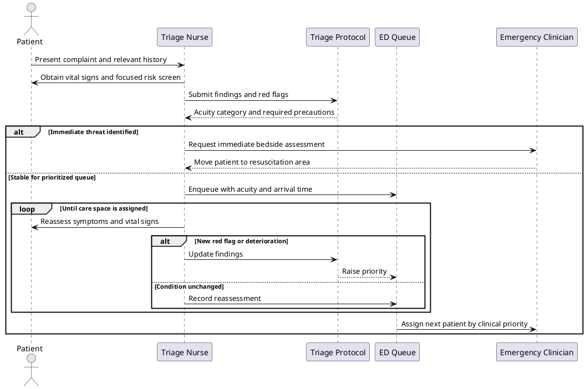
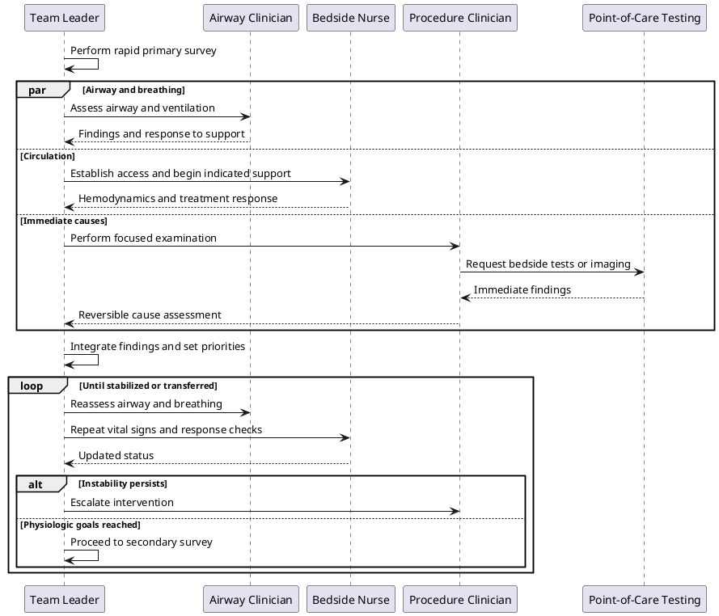
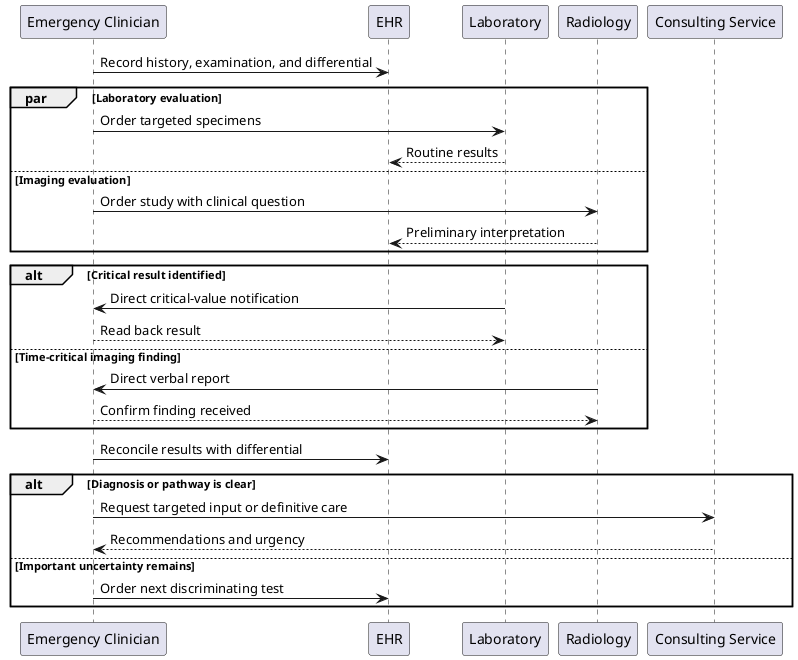
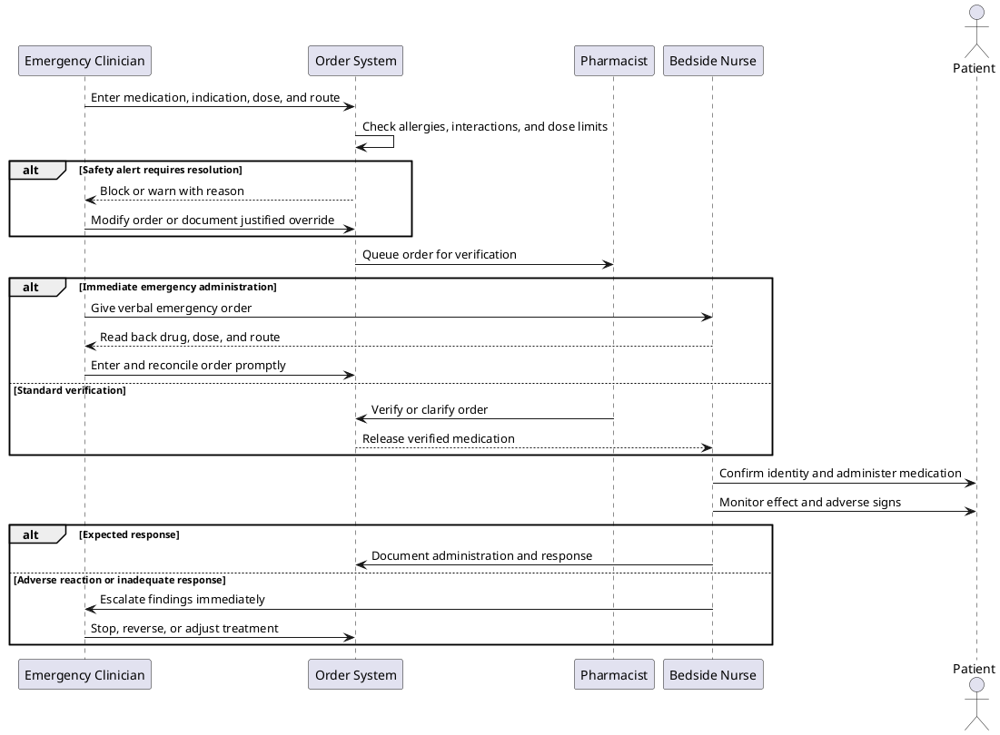
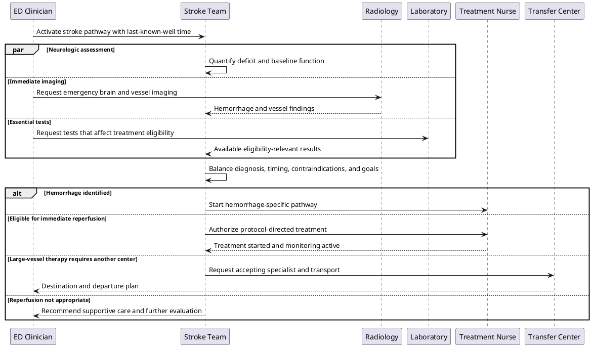
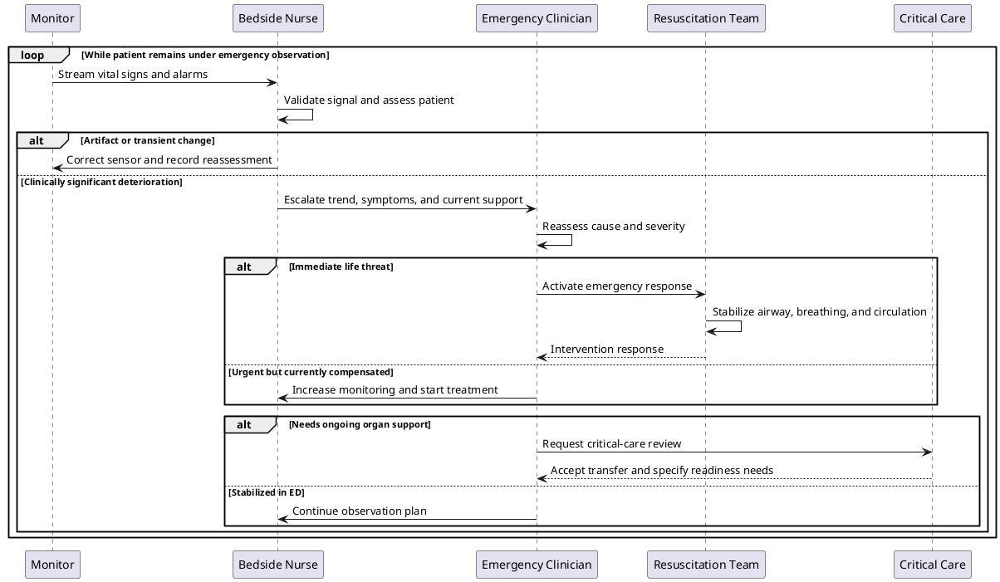
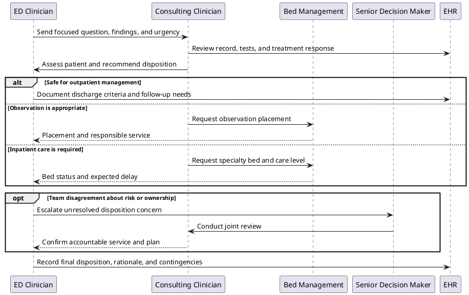
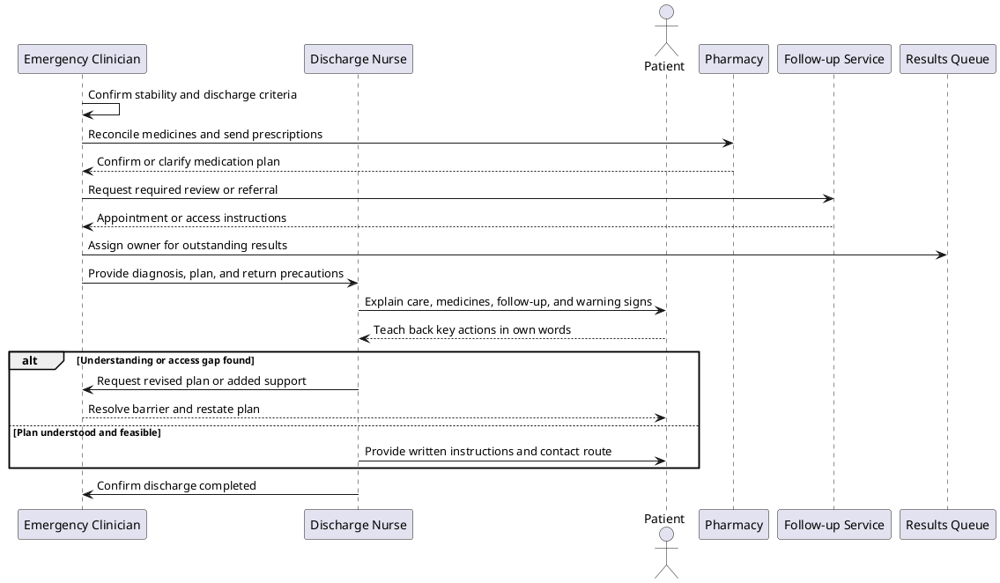
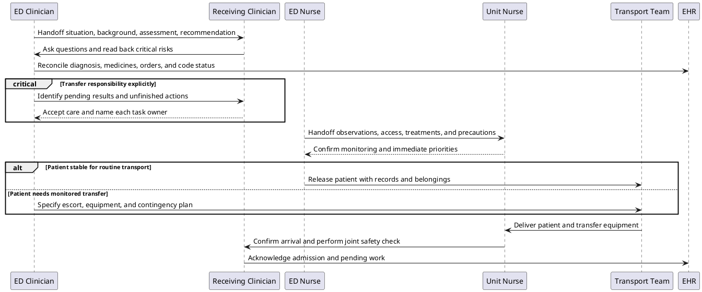

# Emergency Care

## 1. Pre-arrival notification and team readiness

Shows how an ambulance alert lets the emergency department prepare the right people and resources before a high-acuity patient arrives.

## 2. Triage, prioritization, and waiting-room reassessment

Illustrates how initial risk determines placement while repeated observations detect patients who worsen before a clinician is available.

## 3. Primary survey and coordinated resuscitation

Depicts a team leader coordinating parallel airway, breathing, circulation, and bedside assessment work through repeated stabilization cycles.

## 4. Hypothesis-driven diagnostic workup

Shows tests being selected from a working differential, results arriving asynchronously, and critical findings changing the diagnostic plan immediately.

## 5. Closed-loop medication treatment

Tracks an emergency medication from order through safety checks, administration, effect assessment, and response to an adverse reaction.

## 6. Time-critical stroke pathway

Highlights the compressed coordination required to establish timing, exclude hemorrhage, judge reperfusion eligibility, and avoid delay in definitive care.

## 7. Continuous monitoring and deterioration escalation

Explains how bedside observations become a validated alert, rapid intervention, and escalation to critical care when a patient deteriorates.

## 8. Consultation and disposition coordination

Shows how the emergency team obtains specialist input, resolves disagreement, and coordinates the level and location of ongoing care.

## 9. Safe discharge and follow-up

Details the checks, reconciliation, teach-back, safety net, and pending-result ownership needed before a patient leaves emergency care.

## 10. Admission transfer and clinical handoff

Models a structured handoff that establishes shared understanding, explicit task ownership, and continuity during transfer from the ED to an inpatient unit.

